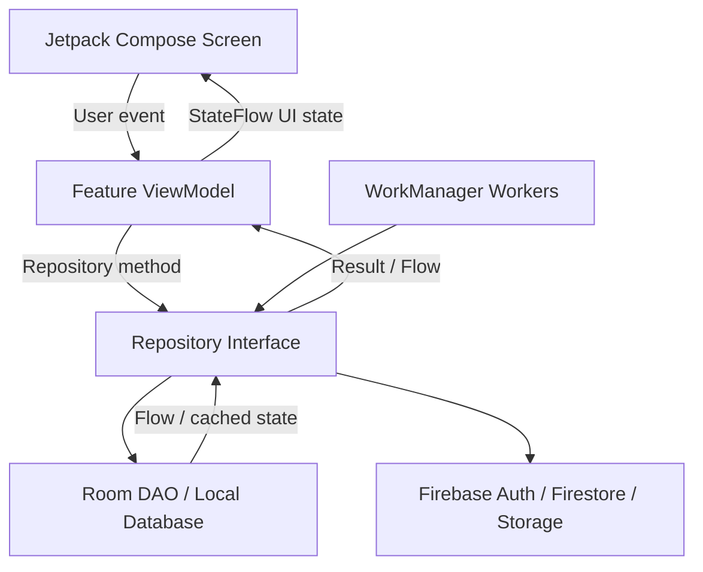

# Spendly

**Spendly** is a local-first personal finance tracker for Android, built with Kotlin and Jetpack Compose. It helps users record income and expenses, monitor savings goals, create monthly budgets, manage recurring transactions, review analytics, and keep financial data synchronized between Room and Firebase Firestore.

The current development branch is `spendly-v2.1`.

> The Gradle application metadata currently uses `versionName = "1.0"` and `versionCode = 1`. Update these values in `app/build.gradle.kts` before publishing a v2.1 release.

## Contents

- [Main Features](#main-features)
- [Screens and Navigation](#screens-and-navigation)
- [Technology Stack](#technology-stack)
- [Architecture](#architecture)
- [Local-First Data Flow](#local-first-data-flow)
- [Database and Cloud Schema](#database-and-cloud-schema)
- [Sync and Background Work](#sync-and-background-work)
- [Notifications](#notifications)
- [Currency and Money Handling](#currency-and-money-handling)
- [Project Structure](#project-structure)
- [Getting Started](#getting-started)
- [Firebase Setup](#firebase-setup)
- [Building and Testing](#building-and-testing)
- [Team Domains](#team-domains)
- [Known Limitations](#known-limitations)

## Main Features

### Authentication and Profile

- Firebase email/password registration and login.
- Password reset and password update flows.
- User profile with name, email, avatar/profile image, default currency, appearance settings, and accent-color personalization.
- System, light, and dark theme modes.
- Profile image support using Firebase Storage.
- Account logout and account deletion flows.

### Dashboard

- Current-month income, expenses, net savings, and savings rate.
- Premium theme-aware financial summary card.
- Quick actions for adding income and expenses.
- Shortcuts to Goals, Budget, Recurring Transactions, Analytics, History, and Profile.
- Goal, budget, recurring-item, and recent-transaction previews.
- Recent transactions exclude future-dated scheduled records.

### Transactions

- Add, edit, delete, and list income and expense transactions.
- Store money as `Long` cents to avoid floating-point errors in calculations.
- Store the financial event date separately from creation/update timestamps.
- Filter History by month and transaction type.
- Group transactions by event date and order same-day entries by creation time.
- Currency conversion metadata, manual exchange rates, and crypto-related fields.
- Expense categories, payment methods, committed/discretionary types, and notes.

### Goals

- Create, edit, delete, and view savings goals.
- Mark multiple goals as primary.
- Automatically suggest goal icons and allow manual icon/color selection.
- Optional goal images.
- Add savings while preventing the saved value from exceeding the target.
- Goal savings create linked expense records for consistent analytics and history.

### Budgets

- Create monthly category budgets.
- Calculate spent and remaining amounts from real expense records.
- Display budget progress, warning state, and exceeded state.
- Local budget alerts.
- Cloud synchronization through Firestore.

### Recurring Transactions

- Create recurring income or expense rules.
- Supports daily, weekly, monthly, and yearly frequencies.
- Pause, resume, edit, and delete rules.
- Generate due transactions with duplicate prevention using recurring rule and period keys.
- Limit missed-occurrence generation to prevent excessive historical generation.
- Generated transactions appear in financial history.

### Analytics and Reports

- Selected-month income, expenses, and net savings.
- Spending-by-category breakdown.
- Committed versus discretionary spending.
- Income-source analysis.
- Five-month overview.
- Smart financial insights.
- CSV and multi-page detailed PDF exports.

### Notifications

- Local in-app notification center backed by Room.
- Android system notifications for app notifications, budget alerts, and daily reminders.
- Daily reminder preferences:
  - Enable or disable reminders.
  - Select reminder time.
  - Remind for income, expenses, or both.
  - Smart mode skips reminders when selected transaction types already exist for today.
- Mark all notifications as read and delete individual notifications.

## Screens and Navigation

The application uses Navigation Compose. The primary floating navigation bar contains:

```text
Home | Analytics | Add | History | Profile
```

The center Add button opens:

- Add Income
- Add Expense
- Add Goal
- Create Budget

Additional routes include:

| Route | Purpose |
|---|---|
| `splash` | Startup branding and session-loading entry |
| `auth` | Sign-in screen |
| `create_account` | Account-registration screen |
| `firebase_setup` | Firebase configuration guidance |
| `home` | Main dashboard |
| `events` | Transaction History |
| `analytics` | Analytics and insights |
| `budget` | Monthly category budgets |
| `recurring` | Recurring transaction rules |
| `notifications` | Local notification center |
| `goals` | Goal tracker |
| `add_goal` | Create goal |
| `goal_detail` | Goal details and add-savings flow |
| `edit_goal` | Edit or delete goal |
| `add_income` | Add or edit income |
| `add_expense` | Add or edit expense |
| `profile` | Profile and application settings |

## Technology Stack

| Technology | Usage |
|---|---|
| Kotlin 1.9.24 | Application language |
| Jetpack Compose | Declarative UI |
| Material Design 3 | Components, themes, color schemes, typography |
| MVVM | Separation between UI, state, and data operations |
| StateFlow / Flow | Reactive UI and Room observation |
| Coroutines | Asynchronous repository, Firebase, and worker operations |
| Navigation Compose | Screen routing and transitions |
| Room 2.6.1 | Local source of truth and offline cache |
| Firebase Authentication | Email/password user authentication |
| Firebase Firestore | Per-user cloud data synchronization |
| Firebase Storage | Profile and goal images |
| Hilt 2.51.1 | Dependency injection |
| WorkManager 2.9.1 | Periodic sync, reminders, and budget-alert checks |
| KSP | Room and Hilt code generation |

Android configuration:

| Setting | Value |
|---|---|
| Package | `com.spendly.financetracker` |
| Minimum SDK | 26 |
| Target SDK | 34 |
| Compile SDK | 34 |
| Java/JVM target | 17 |

## Architecture

Spendly follows MVVM with repositories coordinating local and remote data.



### UI Layer

Compose screens display immutable state and trigger callbacks or ViewModel actions. Screens do not directly call DAOs or Firebase.

Important files:

- `ui/FinanceTrackerApp.kt` - app shell, navigation host, floating bottom navigation, and add-action overlay.
- `ui/screen/**` - feature screens.
- `ui/components/**` - reusable cards, navigation, transaction rows, month picker, and design tokens.
- `ui/theme/**` - light/dark theme, typography, colors, and selectable accent palettes.

### ViewModel Layer

Feature ViewModels own validation, screen state, filtering, and user actions.

Examples:

- `FinanceViewModel` - session, profile, shared finance state, login sync, and app-level actions.
- `TransactionsViewModel` - month/type filtering, grouping, and deletion.
- `AnalyticsViewModel` - analytics aggregation and report exports.
- `GoalsViewModel` - goal updates, savings validation, and linked goal expenses.
- `BudgetViewModel` - budget CRUD and real expense-based progress.
- `RecurringViewModel` - recurring-rule management and due generation.
- `NotificationsViewModel` - in-app notifications and Android system notification dispatch.

### Repository Layer

Repository interfaces are under `data/repository/`. Implementations are under `data/remote/`.

Repositories:

- Write changes to Room first.
- Keep records available offline.
- Mark cloud-pending records with `isSynced = false`.
- Synchronize changes with Firestore.
- Read compatible defaults from older Firestore documents.

### Dependency Injection

Hilt modules are located under `di/`:

- `AppModule.kt` provides Firebase, Room, DAOs, WorkManager, and migrations.
- `RepositoryModule.kt` binds repository interfaces to implementations.

`SpendlyApplication.kt` is annotated with `@HiltAndroidApp`.

## Local-First Data Flow

Spendly treats Room as the local source of truth.

### Write Flow

```text
User saves data
    -> ViewModel validates input
    -> Repository writes Room record with isSynced=false
    -> UI updates immediately from Room Flow
    -> Repository/WorkManager attempts Firestore upload
    -> Successful upload marks local record as synced
```

### Startup and Login Flow

```text
App opens
    -> Existing Room records remain visible
    -> Firebase session identifies current uid
    -> Repositories pull newer Firestore records
    -> Local and remote records merge by updatedAtMillis
    -> Room Flow updates screens
```

This design allows the dashboard, history, goals, analytics, budgets, and recurring rules to remain useful when the device is offline.

## Database and Cloud Schema

### Room Database

The Room database is currently **version 10** and uses non-destructive migrations from versions 1 through 10.

| Room Entity/Table | Purpose |
|---|---|
| `IncomeEntryEntity` / `income_entries` | Income records |
| `ExpenseEntryEntity` / `expense_entries` | Expense records |
| `SavingsGoalEntity` / `savings_goals` | Savings goals |
| `UserProfileEntity` / `user_profiles` | Profile and user settings |
| `BudgetEntity` / `budget_entries` | Monthly category budgets |
| `RecurringRuleEntity` / `recurring_rules` | Recurring transaction rules |
| `BudgetAlertEntity` / `budget_alerts` | Prevents duplicate local budget alerts |
| `ExchangeRateEntity` / `exchange_rates` | Cached exchange-rate data |
| `SyncConflictEntity` / `sync_conflicts` | Recorded sync-conflict metadata |
| `SyncMetadataEntity` / `sync_metadata` | Incremental sync status and timestamps |
| `NotificationEntity` / `notifications` | Local in-app notifications |

### Firestore Structure

Cloud data is stored below the authenticated Firebase UID:

```text
users/{uid}/profile/main
users/{uid}/income/{incomeId}
users/{uid}/expenses/{expenseId}
users/{uid}/goals/{goalId}
users/{uid}/budgets/{budgetId}
users/{uid}/recurringRules/{ruleId}
```

Local notifications, budget-alert deduplication records, cached exchange rates, and sync metadata are not currently synchronized to Firestore.

### Firebase Storage Structure

```text
users/{uid}/profile/{fileName}
users/{uid}/goals/{goalId}/{fileName}
```

Storage rules restrict access to the authenticated owner and allow image files smaller than 5 MB.

### Core Data Rules

- `userId`/`uid` identifies the authenticated owner.
- Financial amounts are stored as `Long` cents.
- `dateMillis` is the user-selected financial event date.
- `createdAtMillis` and `updatedAtMillis` are audit and synchronization timestamps.
- `isSynced` identifies local changes waiting for cloud upload.
- Recurring-generated transactions store `recurringRuleId` and `recurringPeriodKey` to prevent duplicates.
- Goal-saving expenses store a linked `goalId`.

## Sync and Background Work

Spendly uses three Hilt-enabled WorkManager workers:

| Worker | Responsibility |
|---|---|
| `SpendlySyncWorker` | Generates due recurring records and synchronizes profile, income, expenses, goals, budgets, and recurring rules |
| `BudgetAlertWorker` | Checks category budget thresholds and posts alerts |
| `DailyReminderWorker` | Checks today’s transactions and posts configured reminders |

`SyncManager` schedules:

- Periodic background synchronization.
- Immediate synchronization after important writes or sign-in.
- Periodic budget-alert checks.
- Daily reminder work.

Firestore pulls use stored sync metadata to request records newer than the last pull timestamp where supported.

## Notifications

Spendly has two related notification systems:

1. **In-app notifications**
   - Persisted in Room.
   - Displayed on the Notifications screen.
   - Can be marked read or deleted.

2. **Android system notifications**
   - Posted through notification channels.
   - Uses a dedicated monochrome notification icon.
   - Requires `POST_NOTIFICATIONS` permission on Android 13+.

Current channels include:

- Spendly Notifications
- Spendly Reminders
- Budget alerts

No Firebase Cloud Messaging or push-notification backend is currently used.

## Currency and Money Handling

- Calculated amounts use `amountCents: Long`.
- `amountCents` represents the normalized amount in the user’s default currency.
- Original transaction information can include:
  - `originalAmount`
  - `originalCurrency`
  - `defaultCurrency`
  - `exchangeRate`
- Manual exchange rates allow saving when a remote rate is unavailable.
- Crypto income can store coin name, crypto amount, rate, source, and fetched timestamp.
- Amount displays use shared comma formatting.

## Project Structure

```text
Financial-Tracker-Mobile-Kotlin/
├── app/
│   ├── build.gradle.kts
│   └── src/main/
│       ├── AndroidManifest.xml
│       ├── kotlin/com/spendly/financetracker/
│       │   ├── MainActivity.kt
│       │   ├── SpendlyApplication.kt
│       │   ├── data/
│       │   │   ├── firebase/       # Firebase configuration checks
│       │   │   ├── local/
│       │   │   │   ├── dao/        # Room query interfaces
│       │   │   │   ├── db/         # SpendlyDatabase and migrations
│       │   │   │   └── entity/     # Room entities
│       │   │   ├── model/          # Domain/data models
│       │   │   ├── remote/         # Repository implementations
│       │   │   ├── repository/     # Repository contracts
│       │   │   └── service/        # Rates, reports, notifications, sync helpers
│       │   ├── di/                 # Hilt modules
│       │   ├── ui/
│       │   │   ├── components/     # Shared Compose UI
│       │   │   ├── navigation/     # Routes and navigation helpers
│       │   │   ├── screen/         # Feature screens
│       │   │   ├── theme/          # Light/dark/accent themes
│       │   │   ├── util/           # UI formatting helpers
│       │   │   └── viewmodel/      # Feature ViewModels and UI states
│       │   ├── util/               # Mappers and SyncManager
│       │   └── worker/             # WorkManager workers
│       └── res/                    # Android resources and launcher assets
├── docs/                            # Markdown technical documentation
├── firebase.json
├── firestore.rules
├── firestore.indexes.json
├── storage.rules
├── gradle/libs.versions.toml
└── settings.gradle.kts
```

## Getting Started

### Prerequisites

- Android Studio with Android SDK 34.
- JDK 17.
- A Firebase project.
- An Android emulator or physical device running Android 8.0/API 26 or newer.

### Clone

```bash
git clone https://github.com/chamikalakshan/Spendly.git
cd Spendly
```

### Firebase Configuration

Create or use a Firebase Android application with package:

```text
com.spendly.financetracker
```

Download `google-services.json` and place it at:

```text
app/google-services.json
```

Enable:

- Authentication -> Email/Password.
- Cloud Firestore.
- Firebase Storage.

See `firebase_&_firestore.md` and `docs/Firebase_Security_Setup.md` for additional setup guidance.

## Firebase Setup

### Deploy Rules

Install and authenticate the Firebase CLI:

```bash
npm install -g firebase-tools
firebase login
firebase use <your-firebase-project-id>
```

Deploy Firestore and Storage rules:

```bash
firebase deploy --only firestore:rules,firestore:indexes,storage
```

The included Firestore rules:

- Require authentication.
- Restrict each user to their own `users/{uid}` documents.
- Validate ownership, timestamps, and primary money fields.

Before production release, configure Firebase App Check and review all rule validation against the final schema.

## Building and Testing

### Compile Kotlin

```bash
./gradlew :app:compileDebugKotlin
```

### Build Debug APK

```bash
./gradlew :app:assembleDebug
```

Generated APK:

```text
app/build/outputs/apk/debug/app-debug.apk
```

### Run Unit Tests

```bash
./gradlew test
```

### Recommended Manual Verification

1. Register and sign in.
2. Add income and expenses in the default currency.
3. Add a transaction using a manual exchange rate.
4. Verify dashboard and History updates from Room.
5. Create a goal and add savings.
6. Verify a goal-linked expense appears in History.
7. Create a budget and verify progress reacts to expenses.
8. Create a recurring rule and generate due transactions.
9. Confirm duplicate recurring records are not generated.
10. Open Analytics and export CSV/PDF reports.
11. Enable daily reminders and grant notification permission.
12. Test offline creation, then reconnect and verify synchronization.
13. Test light, dark, and system appearance modes.

## Team Domains

The project work is divided into four feature domains. Shared navigation, theme, models, and foundational architecture support all members.

| Member | Main Domain |
|---|---|
| Chamika | Dashboard, Profile, related UI/components, and backend communication |
| Yesen | Transactions, Add Income/Expense, Create Account, and related backend communication |
| Nikini | Goals, Login, and related backend communication |
| Mahima | Analytics, initial Room/Firebase setup, caching, synchronization, and WorkManager |

## Security Notes

- Firestore and Storage rules restrict access using Firebase Authentication UID.
- Android backups are configured through Android resource rules.
- Exported reports are created in the application cache.
- Financial data is stored locally in Room and is not currently encrypted with SQLCipher.
- `google-services.json` identifies the Firebase project but is not a server credential. API-key restrictions and Firebase App Check should still be configured before production.
- Never commit service-account JSON files, keystores, signing passwords, or private backend credentials.

## Known Limitations

- Room data is not encrypted at rest.
- WorkManager reminder execution is battery-friendly but not guaranteed to occur at an exact minute.
- No Firebase Cloud Messaging or remote push notifications.
- Profile and goal image synchronization depends on Firebase Storage configuration and permissions.
- Exchange-rate availability depends on the configured service; manual rates remain the fallback.
- Automated test coverage is currently limited compared with the application’s feature scope.
- Release signing and production publishing configuration are not included.
- Some account deletion and conflict-resolution behavior is client-managed; a trusted backend or Cloud Function would provide stronger production guarantees.

## Future Improvements

- Add comprehensive ViewModel, repository, migration, and UI tests.
- Add encrypted local database storage.
- Add Firebase App Check and emulator-based security-rule tests.
- Improve conflict-resolution UI for simultaneous multi-device edits.
- Add exact reminder scheduling where the product requirements justify the permission and battery impact.
- Add richer budget forecasting and advanced insights.
- Add accessible localization and multiple-language support.

## License

No license file is currently included. Add a license before distributing or accepting external contributions.
