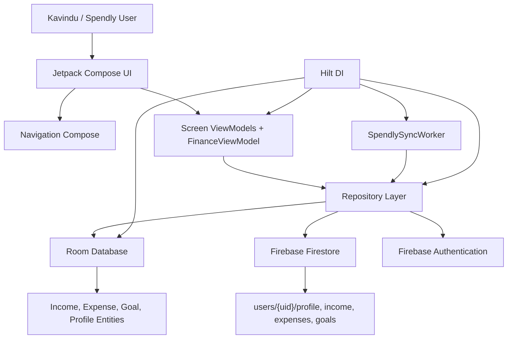
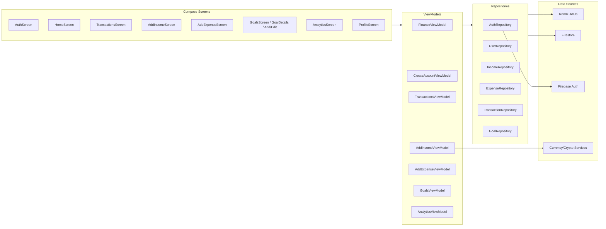
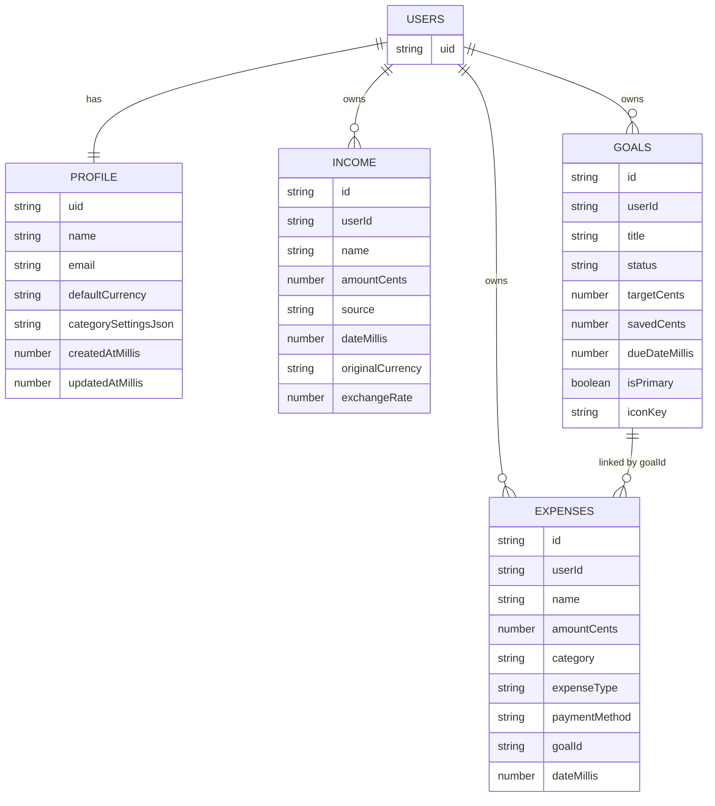
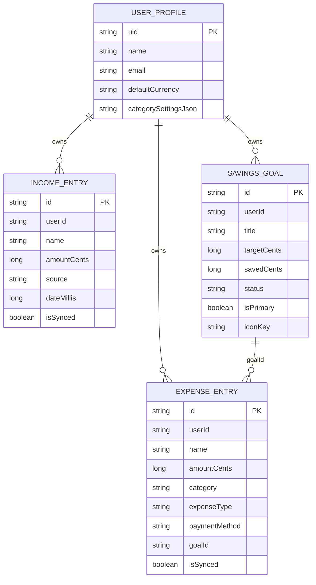
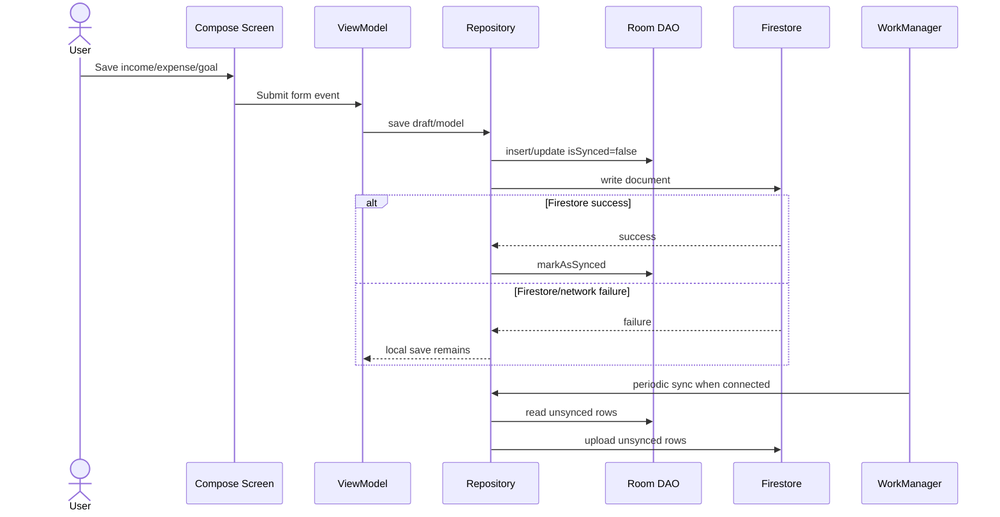
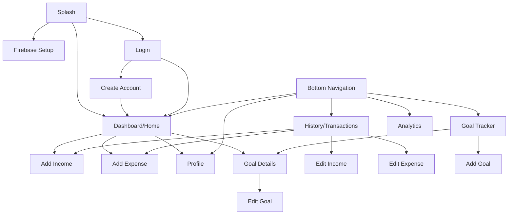
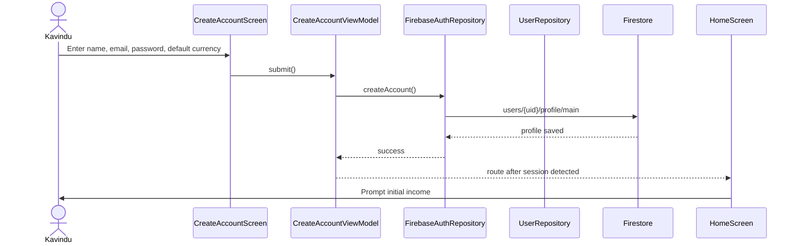
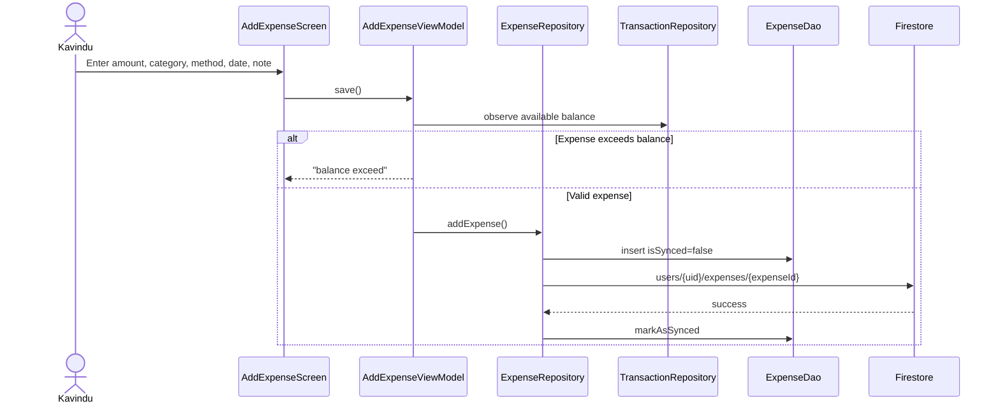
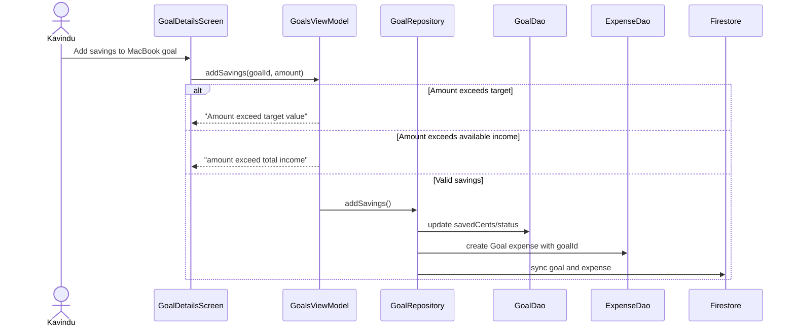
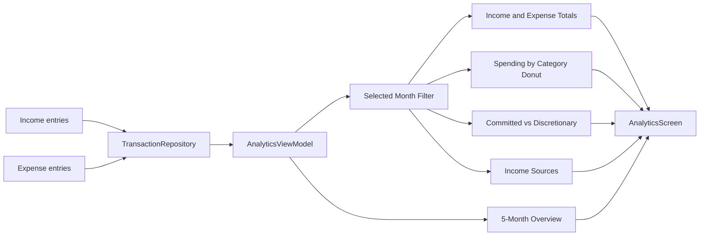

# Spendly Technical Design Report Notes

This document contains the technical details and diagram content needed to prepare the final SE3092 Assignment 01 technical design document for Spendly. It is aligned with the implemented Kotlin/Jetpack Compose codebase and Kavindu Silva's scenario.

## 1. Assignment Alignment

Assignment title: Designing a Personal Finance Management System for Android.

Required stack:

- Kotlin only
- Jetpack Compose UI
- Material Design 3
- Navigation Compose
- MVVM architecture
- StateFlow/coroutines
- Firebase Authentication
- Firebase Firestore
- Room local caching
- Hilt dependency injection
- Minimum SDK API 26
- Target SDK 34+

Implemented Spendly stack:

- Single-activity Android application
- Kotlin + Jetpack Compose
- Material 3 UI components
- Navigation Compose routes through `Screen.kt` and `FinanceTrackerApp.kt`
- MVVM with separated screen ViewModels
- Repository pattern for auth, profile, transactions, goals, and analytics
- Firebase Auth for email/password identity
- Firestore cloud persistence under `users/{uid}`
- Room database for offline-first local cache
- WorkManager sync every 15 minutes and immediate sync after key writes/sign-in
- Hilt for ViewModel, repository, database, Firebase, DAO, and worker injection

## 2. Kavindu Scenario Summary

Kavindu Silva is a 25-year-old junior software engineer in Colombo. He earns from multiple irregular sources:

- Monthly salary in LKR
- Freelance projects in LKR
- Google AdSense in USD
- Cryptocurrency trading income/losses

His problems:

- Cannot calculate actual monthly income because income is scattered across sources and currencies.
- Cannot understand expenses because spending happens through card, cash, food delivery, transport, gym, rent, subscriptions, and other channels.
- Cannot distinguish committed spending from discretionary spending.
- Wants to buy a MacBook Pro M4 for about LKR 490,000 within 12 months.
- Previous tracking tools failed because they were too manual, too rigid, USD-only, not cloud-synced, or not built for irregular multi-source income.

How Spendly addresses this:

- Add income by source, date, currency, exchange rate, crypto data, and recurrence.
- Add expenses by category, payment method, expense type, date, and note.
- Dashboard gives monthly income, monthly expense, total balance, net savings, yearly savings, primary goal, and recent transactions.
- History groups transactions by selected event date.
- Analytics visualizes category spending, committed vs discretionary spending, income sources, and 5-month overview.
- Goal tracker connects daily savings to MacBook or other goals.
- Firebase Auth and Firestore make data available across devices.
- Room + WorkManager reduce failure when offline.

## 3. Functional Requirements

### Authentication

- User can create an account using name, email, password, confirm password, and default currency.
- User can log in with email/password.
- User can request password reset email.
- User can change password after entering current password, new password, and confirm password.
- User can delete account after reauthentication.
- App uses Firebase `uid` as the owner key for all user data.

Implemented files:

```text
app/src/main/kotlin/com/spendly/financetracker/ui/screen/AuthScreen.kt
app/src/main/kotlin/com/spendly/financetracker/ui/screen/CreateAccountScreen.kt
app/src/main/kotlin/com/spendly/financetracker/ui/viewmodel/FinanceViewModel.kt
app/src/main/kotlin/com/spendly/financetracker/ui/viewmodel/CreateAccountViewModel.kt
app/src/main/kotlin/com/spendly/financetracker/data/repository/AuthRepository.kt
app/src/main/kotlin/com/spendly/financetracker/data/repository/FirebaseAuthRepository.kt
```

### Dashboard

- Show Kavindu's greeting and profile entry point.
- Show total balance.
- Show monthly income and monthly expense.
- Show monthly net savings and yearly net savings.
- Show current/primary goal progress.
- Show recent transactions.
- Provide green add action menu for income/expense.

Implemented files:

```text
app/src/main/kotlin/com/spendly/financetracker/ui/screen/home/HomeScreen.kt
app/src/main/kotlin/com/spendly/financetracker/ui/viewmodel/FinanceUiState.kt
app/src/main/kotlin/com/spendly/financetracker/ui/components/SpendlyAddActionMenu.kt
```

### Income Management

- Add salary, freelance, AdSense, crypto, and other income.
- Store selected income source.
- Store user-entered event date as `dateMillis`.
- Store original amount/currency and default-currency converted value.
- Support USD/default-currency exchange rate entry.
- Support crypto amount, coin, rate, source, and fetched timestamp.
- Support recurring monthly toggle.
- Save locally first and sync with Firestore.

Implemented files:

```text
app/src/main/kotlin/com/spendly/financetracker/ui/screen/transactions/AddIncomeScreen.kt
app/src/main/kotlin/com/spendly/financetracker/ui/viewmodel/AddIncomeViewModel.kt
app/src/main/kotlin/com/spendly/financetracker/data/repository/IncomeRepository.kt
app/src/main/kotlin/com/spendly/financetracker/data/remote/IncomeRepositoryImpl.kt
app/src/main/kotlin/com/spendly/financetracker/data/local/dao/IncomeDao.kt
app/src/main/kotlin/com/spendly/financetracker/data/local/entity/IncomeEntryEntity.kt
```

### Expense Management

- Add expenses with amount, category, payment method, expense type, date, and note.
- Store selected event date as `dateMillis`.
- Support category creation/hiding through synced category settings.
- Show category-specific icons.
- Enforce balance rule: expenses cannot exceed available total income/balance.
- Save locally first and sync with Firestore.

Implemented files:

```text
app/src/main/kotlin/com/spendly/financetracker/ui/screen/transactions/AddExpenseScreen.kt
app/src/main/kotlin/com/spendly/financetracker/ui/viewmodel/AddExpenseViewModel.kt
app/src/main/kotlin/com/spendly/financetracker/data/repository/ExpenseRepository.kt
app/src/main/kotlin/com/spendly/financetracker/data/remote/ExpenseRepositoryImpl.kt
app/src/main/kotlin/com/spendly/financetracker/data/local/dao/ExpenseDao.kt
app/src/main/kotlin/com/spendly/financetracker/data/local/entity/ExpenseEntryEntity.kt
```

### Transaction History

- Show month dropdown.
- Show All, Income, and Expense filters.
- Group transactions by `dateMillis`, not creation date.
- Show category/source labels.
- Expand rows to view details.
- Edit/delete transactions.

Implemented files:

```text
app/src/main/kotlin/com/spendly/financetracker/ui/screen/transactions/TransactionsScreen.kt
app/src/main/kotlin/com/spendly/financetracker/ui/viewmodel/TransactionsViewModel.kt
app/src/main/kotlin/com/spendly/financetracker/ui/components/TransactionListItem.kt
```

### Goal Tracking

- Add, edit, delete, and view goals.
- Track target amount, saved amount, due date, status, primary flag, default currency, and icon key.
- Automatically suggest icon based on goal name.
- Allow manual icon override.
- Add savings to a goal.
- Reject savings above target value.
- Reject savings above available income/balance.
- Create goal-saving expense transaction with category `Goal` and linked `goalId`.
- Mark achieved goals as `Done` and remove primary flag.
- Display primary, other, and achieved goal sections.

Implemented files:

```text
app/src/main/kotlin/com/spendly/financetracker/ui/screen/goals/GoalScreen.kt
app/src/main/kotlin/com/spendly/financetracker/ui/screen/goals/AddGoalScreen.kt
app/src/main/kotlin/com/spendly/financetracker/ui/screen/goals/GoalDetailsScreen.kt
app/src/main/kotlin/com/spendly/financetracker/ui/screen/goals/EditGoalScreen.kt
app/src/main/kotlin/com/spendly/financetracker/ui/screen/goals/GoalsScreen.kt
app/src/main/kotlin/com/spendly/financetracker/ui/viewmodel/GoalsViewModel.kt
app/src/main/kotlin/com/spendly/financetracker/ui/util/GoalIconUtils.kt
app/src/main/kotlin/com/spendly/financetracker/data/repository/GoalRepository.kt
app/src/main/kotlin/com/spendly/financetracker/data/remote/GoalRepositoryImpl.kt
```

### Analytics

- Show selected month total income and total expenses.
- Show spending by category with donut chart and percentages.
- Show committed vs discretionary split.
- Show 5-month income/expense overview.
- Show income source breakdown.
- Use live database-backed transactions.

Implemented files:

```text
app/src/main/kotlin/com/spendly/financetracker/ui/screen/analytics/AnalyticsScreen.kt
app/src/main/kotlin/com/spendly/financetracker/ui/viewmodel/AnalyticsViewModel.kt
```

### Profile

- Show profile avatar, name, and email.
- Edit profile name and profile image URI.
- Select default currency.
- Show exchange-rate explanation.
- Change password.
- Delete account.
- Logout.

Implemented files:

```text
app/src/main/kotlin/com/spendly/financetracker/ui/screen/profile/ProfileScreen.kt
app/src/main/kotlin/com/spendly/financetracker/ui/viewmodel/ProfileViewModel.kt
app/src/main/kotlin/com/spendly/financetracker/data/repository/UserRepository.kt
app/src/main/kotlin/com/spendly/financetracker/data/remote/UserRepositoryImpl.kt
```

## 4. Non-Functional Requirements

- Offline-first experience through Room and Firestore local persistence.
- Network failures should not block local saves.
- Cloud sync must preserve local unsynced data.
- Firebase `uid` must be the only ownership key.
- No hardcoded user finance data.
- Calculations should be performed in ViewModels/state models, not Composables.
- Material Design 3 components should be used.
- App should handle empty states for no transactions, no analytics, and no goals.
- Money should be stored as cents (`Long`) to avoid floating-point calculation errors.
- UI should be low-friction because Kavindu abandoned previous tools due to manual overhead.

## 5. Constraints

- No bank import/API integration is implemented.
- Profile image is stored as a local URI string, not uploaded to Firebase Storage.
- Firestore collections appear only after first document write.
- Currency API is optional; manual exchange rate entry must work.
- Existing app supports only email/password auth, not Google Sign-In.

## 6. System Architecture

### Architecture Summary

Spendly uses a layered MVVM architecture:

- UI layer: Jetpack Compose screens and reusable components.
- ViewModel layer: StateFlow-based UI state and business logic.
- Repository layer: abstract data operations and sync policies.
- Local data layer: Room DAOs and entities.
- Remote data layer: Firebase Auth and Firestore.
- Background sync: Hilt WorkManager worker.

### Diagram Needed: System Architecture

Use this diagram in the final document.



## 7. MVVM Screen Mapping

| Screen | ViewModel | Repository/Data Source | Purpose |
| --- | --- | --- | --- |
| Splash | FinanceViewModel | AuthRepository | Wait 1800 ms, route based on auth/config state |
| Login | FinanceViewModel | AuthRepository | Sign in, forgot password |
| Create Account | CreateAccountViewModel | AuthRepository, UserRepository | Register and create profile |
| Dashboard | FinanceViewModel / FinanceUiState | TransactionRepository, GoalRepository, UserRepository | Summaries, recent transactions, primary goal |
| History | TransactionsViewModel | TransactionRepository | Filter, group, edit/delete transactions |
| Add Income | AddIncomeViewModel | IncomeRepository, UserRepository, Currency/Crypto services | Save multi-source income |
| Add Expense | AddExpenseViewModel | ExpenseRepository, TransactionRepository, UserRepository | Save categorized expenses |
| Goals | GoalsViewModel / FinanceUiState | GoalRepository, TransactionRepository | Goal list and savings logic |
| Analytics | AnalyticsViewModel | TransactionRepository | Charts and financial insights |
| Profile | FinanceViewModel/ProfileViewModel | UserRepository, AuthRepository | Profile, password, logout, delete account |

### Diagram Needed: MVVM Architecture Mapping



## 8. Firestore Schema

Firestore root collection:

```text
users/{uid}
```

Subcollections:

```text
users/{uid}/profile/main
users/{uid}/income/{incomeId}
users/{uid}/expenses/{expenseId}
users/{uid}/goals/{goalId}
```

### Collection: `users/{uid}/profile/main`

Purpose: stores user account profile and app settings.

Fields:

| Field | Type | Description |
| --- | --- | --- |
| uid | string | Firebase Auth UID |
| name | string | User display name |
| email | string | User email |
| defaultCurrency | string | Main app currency, e.g. LKR |
| createdAtMillis | number | Created timestamp |
| updatedAtMillis | number | Updated timestamp |
| profileImageUri | string/null | Local profile image URI |
| exchangeRateSettings | string | Future exchange settings |
| notificationFrequency | string/null | Optional reminders |
| reminderTime | string/null | Optional reminder time |
| categorySettingsJson | string | JSON for custom/hidden income and expense categories |

### Collection: `users/{uid}/income/{incomeId}`

Purpose: stores income from salary, freelance, AdSense, crypto, and other sources.

Fields:

| Field | Type | Description |
| --- | --- | --- |
| id | string | Income document ID |
| userId | string | Firebase UID |
| name | string | Income title |
| amountCents | number | Converted default-currency amount in cents |
| source | string | Salary, Freelance, Crypto, AdSense, Other, custom source |
| dateMillis | number | User-selected event date |
| note | string | Optional note |
| createdAtMillis | number | Created timestamp |
| updatedAtMillis | number | Updated timestamp |
| originalAmount | number | Amount entered by user before conversion |
| originalCurrency | string | Selected currency or crypto coin |
| defaultCurrency | string | Profile currency |
| exchangeRate | number/null | Conversion rate |
| isRecurring | boolean | Monthly recurring flag |
| cryptoCoin | string/null | Crypto coin symbol/name |
| cryptoAmount | number/null | Crypto quantity |
| cryptoRate | number/null | Crypto rate in default currency |
| cryptoRateSource | string/null | Manual/API source |
| cryptoRateFetchedAt | number/null | Rate timestamp |

### Collection: `users/{uid}/expenses/{expenseId}`

Purpose: stores expense records.

Fields:

| Field | Type | Description |
| --- | --- | --- |
| id | string | Expense document ID |
| userId | string | Firebase UID |
| name | string | Expense title |
| amountCents | number | Converted default-currency amount in cents |
| category | string | Food, Transport, Rent, Goal, custom category, etc. |
| dateMillis | number | User-selected event date |
| note | string | Optional note |
| createdAtMillis | number | Created timestamp |
| updatedAtMillis | number | Updated timestamp |
| originalAmount | number | Amount entered before conversion |
| originalCurrency | string | Selected transaction currency |
| defaultCurrency | string | Profile currency |
| exchangeRate | number/null | Conversion rate |
| paymentMethod | string/null | Card, Cash, Auto-debit, Goal transfer |
| expenseType | string/null | COMMITTED or DISCRETIONARY |
| goalId | string/null | Linked goal for goal-saving expenses |

### Collection: `users/{uid}/goals/{goalId}`

Purpose: stores savings goals such as Kavindu's MacBook Pro M4 target.

Fields:

| Field | Type | Description |
| --- | --- | --- |
| id | string | Goal document ID |
| userId | string | Firebase UID |
| title | string | Goal name |
| status | string | Tracking, Stopped, Done |
| targetCents | number | Target amount in cents |
| savedCents | number | Saved amount in cents |
| dueDateMillis | number | Target due date |
| category | string | Goal category |
| isPrimary | boolean | Primary goal display flag |
| createdAtMillis | number | Created timestamp |
| updatedAtMillis | number | Updated timestamp |
| initialSavedCents | number | Initial saved amount |
| defaultCurrency | string | Goal currency |
| iconKey | string | Selected icon key, e.g. laptop, travel, transport |

### Diagram Needed: Firestore Schema



## 9. Firestore Indexing Strategy

Current implementation uses simple reads from user-scoped subcollections:

```text
users/{uid}/income
users/{uid}/expenses
users/{uid}/goals
users/{uid}/profile/main
```

Because each query is scoped under one authenticated user's document and mostly reads the full collection into Room, Firestore's automatic single-field indexes are enough for the current version.

Future recommended composite indexes:

| Collection | Fields | Reason |
| --- | --- | --- |
| `users/{uid}/income` | `dateMillis desc, source asc` | Month/source filtering directly in Firestore |
| `users/{uid}/expenses` | `dateMillis desc, category asc` | Category analytics without full collection read |
| `users/{uid}/expenses` | `goalId asc, dateMillis desc` | Query goal-saving expenses |
| `users/{uid}/goals` | `isPrimary asc, dueDateMillis asc` | Primary goal dashboard |
| `users/{uid}/goals` | `status asc, dueDateMillis asc` | Achieved/active goal grouping |

## 10. Firestore Security Rules

The final submission should include rules. Recommended rules:

```javascript
rules_version = '2';
service cloud.firestore {
  match /databases/{database}/documents {
    match /users/{userId} {
      allow read, write: if request.auth != null && request.auth.uid == userId;

      match /profile/{document=**} {
        allow read, write: if request.auth != null && request.auth.uid == userId;
      }

      match /income/{document=**} {
        allow read, write: if request.auth != null && request.auth.uid == userId;
      }

      match /expenses/{document=**} {
        allow read, write: if request.auth != null && request.auth.uid == userId;
      }

      match /goals/{document=**} {
        allow read, write: if request.auth != null && request.auth.uid == userId;
      }
    }
  }
}
```

Justification:

- Every user's data is isolated under `users/{uid}`.
- Authenticated user can only access a document tree where URL `userId` matches `request.auth.uid`.
- No global collections expose private finance records.

## 11. Room Local Database Schema

Room database:

```text
SpendlyDatabase
database file: spendly_database
version: 4
```

Entities:

- `IncomeEntryEntity`
- `ExpenseEntryEntity`
- `SavingsGoalEntity`
- `UserProfileEntity`

DAOs:

- `IncomeDao`
- `ExpenseDao`
- `GoalDao`
- `UserProfileDao`

Migrations:

- `1 -> 2`: adds currency, crypto, payment, goal, profile image/settings, and initial goal saved fields.
- `2 -> 3`: adds `categorySettingsJson`.
- `3 -> 4`: adds `SavingsGoalEntity.iconKey`.

### Room Tables And Indexes

| Table | Primary Key | Important Indexes |
| --- | --- | --- |
| `income_entries` | `id` | `userId`, `dateMillis`, `(userId, dateMillis)`, `source` |
| `expense_entries` | `id` | `userId`, `dateMillis`, `(userId, dateMillis)`, `category` |
| `savings_goals` | `id` | `userId`, `(userId, isPrimary)` |
| `user_profiles` | `uid` | primary key only |

### Diagram Needed: Room ER Diagram



## 12. Sync Design

Sync behavior:

- User action writes to Room first.
- Repository attempts Firestore write.
- On Firestore success, local row is marked `isSynced=true`.
- On Firestore failure, row remains local with `isSynced=false`.
- After sign-in/create-account, repositories sync Firestore to Room.
- WorkManager performs periodic sync with network constraints.
- Remote and local data are merged using `updatedAtMillis`; newer record wins.

Implemented files:

```text
app/src/main/kotlin/com/spendly/financetracker/util/SyncManager.kt
app/src/main/kotlin/com/spendly/financetracker/worker/SpendlySyncWorker.kt
app/src/main/kotlin/com/spendly/financetracker/data/remote/IncomeRepositoryImpl.kt
app/src/main/kotlin/com/spendly/financetracker/data/remote/ExpenseRepositoryImpl.kt
app/src/main/kotlin/com/spendly/financetracker/data/remote/GoalRepositoryImpl.kt
app/src/main/kotlin/com/spendly/financetracker/data/remote/UserRepositoryImpl.kt
```

### Diagram Needed: Offline-First Sync Flow



## 13. Navigation Design

Routes are defined in:

```text
app/src/main/kotlin/com/spendly/financetracker/ui/navigation/Screen.kt
```

Main routes:

```text
splash
auth
create_account
firebase_setup
home
events       // visible label is History
analytics
goals
profile
add_income?incomeId={incomeId}
add_expense?expenseId={expenseId}
add_goal
goal_detail?goalId={goalId}
edit_goal?goalId={goalId}
```

Bottom nav visible routes:

```text
home
events
analytics
goals
profile
```

Bottom nav hidden routes:

```text
splash
auth
create_account
firebase_setup
add_income
add_expense
add_goal
goal_detail
edit_goal
```

### Diagram Needed: Navigation Graph



## 14. Key User Flow Diagrams

### Diagram Needed: Create Account And Initial Setup



### Diagram Needed: Add Expense Flow



### Diagram Needed: Goal Savings Flow



## 15. Analytics Design

Analytics is critical because Kavindu has no financial self-awareness from raw records.

Implemented calculations:

- Selected month income total.
- Selected month expense total.
- Spending by category.
- Category percentage using actual expense total.
- Committed vs discretionary split.
- 5-month monthly overview relative to selected month.
- Income source breakdown.

Analytics data source:

```text
AnalyticsViewModel -> TransactionRepository -> IncomeRepository + ExpenseRepository -> Room/Firestore
```

### Diagram Needed: Analytics Computation Flow



## 16. Data Model Justification

### Money As Cents

Money is stored as `Long` cents (`amountCents`, `targetCents`, `savedCents`) instead of floating point. This avoids rounding errors in totals, net savings, and goal progress.

### `dateMillis` vs `createdAtMillis`

- `dateMillis`: date selected by Kavindu for the income/expense/goal event.
- `createdAtMillis`: audit timestamp for when the record was created.

This matters because Kavindu may enter a PickMe expense today for a ride taken yesterday. Analytics and History must use the event date, not the creation timestamp.

### Multi-Currency Handling

Each income/expense stores:

- `originalAmount`
- `originalCurrency`
- `defaultCurrency`
- `exchangeRate`
- converted `amountCents`

This lets AdSense/USD and crypto entries be recorded in their real source form while still supporting LKR dashboard and analytics totals.

### Category Settings

`categorySettingsJson` is stored in the profile document. It contains:

- custom expense categories
- hidden/deleted default expense categories
- custom income sources
- hidden/deleted default income sources

Reason: Kavindu needs fast, personalized entry without rebuilding categories on every device.

### Goal Icon Key

Goals store `iconKey`:

- auto-suggested from title
- manually overrideable
- persisted in Room and Firestore

Reason: visual recognition reduces friction and makes the MacBook or other goals feel concrete.

## 17. Annotated Wireframes Needed

The assignment requires minimum three annotated wireframes or high-fidelity mockups. For this project, include at least these six because they directly connect to Kavindu's scenario.

### Wireframe 1: Dashboard

Must annotate:

- Green header with greeting/profile entry.
- Total balance card.
- Monthly income and monthly expense cards.
- Monthly net savings and yearly net savings.
- Primary goal progress.
- Recent transactions.
- Floating add action menu.

Scenario connection:

- Gives Kavindu immediate financial clarity without opening four separate apps.

### Wireframe 2: Add Income

Must annotate:

- Source chips: Salary, Freelance, Crypto, AdSense, Other/custom.
- Combined currency dropdown + amount input.
- Exchange rate field when currency differs from default.
- Crypto coin/rate flow.
- Date picker.
- Recurring toggle.
- Save button.

Scenario connection:

- Handles salary, freelance, USD AdSense, and crypto in one consistent form.

### Wireframe 3: Add Expense

Must annotate:

- Combined currency dropdown + amount input.
- Category chips with icons.
- Expense type: committed/discretionary.
- Payment method: Card, Cash, Auto-debit.
- Date picker.
- Note field.
- Balance exceed validation.

Scenario connection:

- Low-friction entry for food delivery, transport, rent, gym, subscriptions, and cash/card expenses.

### Wireframe 4: History/Transactions

Must annotate:

- Month dropdown.
- All/Income/Expenses filter chips.
- Grouping by event date.
- Expandable transaction rows.
- Edit/delete actions.
- Category/source tags.

Scenario connection:

- Solves Kavindu's problem of unreadable bank statement exports.

### Wireframe 5: Goal Tracker And Goal Details

Must annotate:

- Add goal button.
- Primary goals section.
- Other goals section.
- Achieved goals section.
- Goal progress bar.
- Add savings dialog.
- Required monthly savings/projection.
- Icon picker in add/edit goal.

Scenario connection:

- Makes the MacBook Pro M4 goal visible, measurable, and tied to actual saving actions.

### Wireframe 6: Analytics

Must annotate:

- Month selector.
- Total income and expense tiles.
- Spending by category donut chart.
- Committed vs discretionary card.
- 5-month overview bar chart.
- Income source section.

Scenario connection:

- Gives Kavindu the visual spending distribution he never had.

## 18. Documentation Sections Needed In Final PDF

Recommended final document structure:

1. Title page
2. Executive summary
3. Kavindu scenario analysis
4. Problems identified from scenario
5. Functional requirements
6. Non-functional requirements and constraints
7. UX design rationale
8. System architecture
9. MVVM architecture
10. Navigation design
11. Firestore schema and security rules
12. Room schema and offline cache strategy
13. Sync and WorkManager strategy
14. Data model and multi-currency handling
15. Analytics calculation design
16. Goal tracking design
17. Error handling and empty states
18. Annotated wireframes/mockups
19. Testing and verification
20. Limitations and future improvements
21. Conclusion

## 19. Recommended Diagrams Checklist

Include these diagrams in the final document:

- System architecture diagram
- MVVM architecture diagram
- Firestore schema diagram
- Room ER diagram
- Navigation graph
- Offline sync sequence diagram
- Create account sequence diagram
- Add expense sequence diagram
- Goal savings sequence diagram
- Analytics computation flow diagram
- Optional: Hilt dependency graph
- Optional: WorkManager sync lifecycle diagram

## 20. Testing And Verification Notes

Build commands used:

```bash
JAVA_HOME=/Library/Java/JavaVirtualMachines/jdk-17.jdk/Contents/Home sh gradlew :app:compileDebugKotlin
JAVA_HOME=/Library/Java/JavaVirtualMachines/jdk-17.jdk/Contents/Home sh gradlew :app:assembleDebug
```

Manual scenarios to document:

- Create account with default currency.
- Login/logout.
- Forgot password.
- Add initial income.
- Add salary income.
- Add AdSense income with USD conversion.
- Add crypto income with manual/API rate.
- Add expense with category, payment method, and event date.
- Verify History groups by event date.
- Edit/delete transaction.
- Add MacBook Pro M4 goal.
- Add savings and verify linked `Goal` expense.
- Try savings above target and verify error.
- View dashboard totals.
- View analytics charts.
- Change profile currency.
- Change password.
- Test offline create and later sync.

## 21. Future Improvements

- Add Firebase Storage for cross-device profile images.
- Add Google Sign-In.
- Add bank statement CSV import.
- Add recurring transaction generation.
- Add push notifications/reminders.
- Add budgets by category.
- Add invoice tracking for freelance payments.
- Add crypto portfolio tracking with gains/losses.
- Add Firestore composite indexes when server-side filtered queries are introduced.
- Add formal unit tests for ViewModels and repository sync logic.
- Add UI tests for critical Compose flows.

## 22. Codebase Reference Map

Architecture and app shell:

```text
app/src/main/kotlin/com/spendly/financetracker/MainActivity.kt
app/src/main/kotlin/com/spendly/financetracker/SpendlyApplication.kt
app/src/main/kotlin/com/spendly/financetracker/ui/FinanceTrackerApp.kt
app/src/main/kotlin/com/spendly/financetracker/ui/navigation/
app/src/main/kotlin/com/spendly/financetracker/di/
```

Data layer:

```text
app/src/main/kotlin/com/spendly/financetracker/data/local/
app/src/main/kotlin/com/spendly/financetracker/data/model/
app/src/main/kotlin/com/spendly/financetracker/data/repository/
app/src/main/kotlin/com/spendly/financetracker/data/remote/
app/src/main/kotlin/com/spendly/financetracker/util/Mappers.kt
```

Sync:

```text
app/src/main/kotlin/com/spendly/financetracker/util/SyncManager.kt
app/src/main/kotlin/com/spendly/financetracker/worker/SpendlySyncWorker.kt
```

UI screens:

```text
app/src/main/kotlin/com/spendly/financetracker/ui/screen/
```

ViewModels:

```text
app/src/main/kotlin/com/spendly/financetracker/ui/viewmodel/
```

Utilities:

```text
app/src/main/kotlin/com/spendly/financetracker/ui/util/
```

