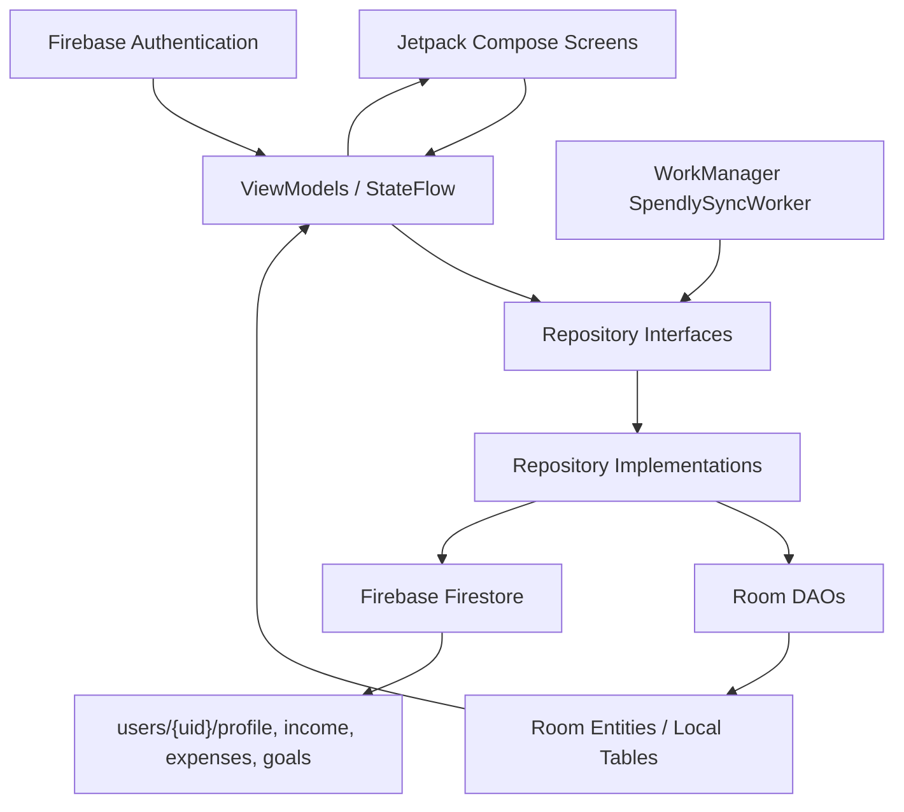
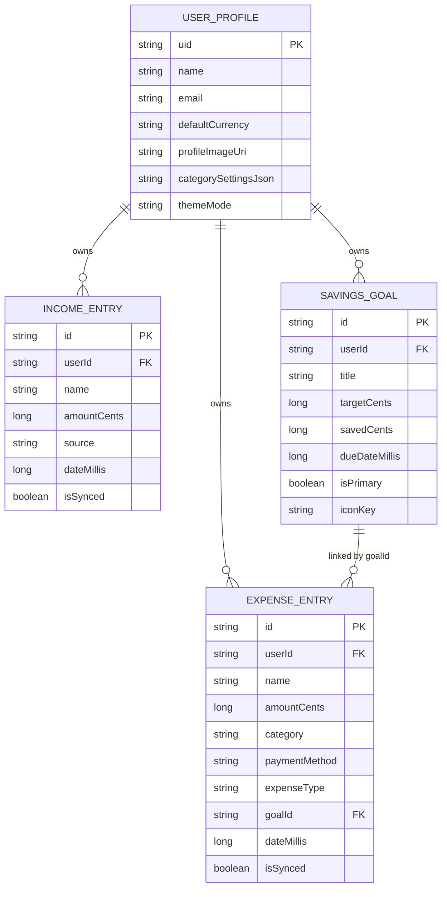

# Software Requirements Specification

## Spendly — Smart Personal Finance Management System

Document version: 1.0  
Prepared for: Kotlin Android Financial Tracker App  
Repository: `/Users/chamikalakshan/Documents/Codex/Financial-Tracker-Mobile-Kotlin`  
Architecture: MVVM with Repository Pattern  
Primary technologies: Kotlin, Jetpack Compose, Firebase Authentication, Firebase Firestore, Room Database, Hilt, WorkManager, Coroutines, Flow, StateFlow

---

## 1. Introduction

### 1.1 Purpose Of The Document

This Software Requirements Specification (SRS) defines the functional and non-functional requirements for **Spendly — Smart Personal Finance Management System**, a Kotlin Android financial tracker application. The document is based on inspection of the current codebase, repository structure, Room database entities, DAO files, ViewModels, repositories, Firebase/Firestore logic, sync logic, UI screens, and available project documentation.

The purpose of this SRS is to:

- Describe what the Spendly system is expected to do.
- Identify implemented, partially implemented, planned, and unclear requirements.
- Connect requirements to actual source files where possible.
- Support university submission, project presentation, viva preparation, and future development.
- Provide a traceable specification for developers and evaluators.

### 1.2 Scope Of The System

Spendly is an Android mobile application that helps users manage personal finance records. The app supports user authentication, profile management, income tracking, expense tracking, transaction history, dashboard summaries, savings goals, analytics, currency handling, local Room storage, Firebase Firestore cloud persistence, and background sync through WorkManager.

The application scope includes:

- Email/password account registration and login.
- User profile creation and updates.
- Default currency and appearance preference storage.
- Income management.
- Expense management.
- Transaction listing, filtering, edit, and delete.
- Dashboard insight cards.
- Savings goal creation, editing, progress display, and savings updates.
- Analytics using persisted income and expense records.
- Local-first storage using Room.
- Firestore cloud sync using Firebase UID as the user owner key.

The application scope does **not clearly include** a separate bank-account or wallet-account entity. The term "account management" in the current implementation mainly refers to user authentication, profile/account actions, logout, password change, and account deletion.

### 1.3 Intended Audience

| Audience | Reason For Using This Document |
|---|---|
| Project team members | Understand requirement coverage and implementation responsibility |
| Lecturers/evaluators | Review whether the project satisfies coursework expectations |
| Developers | Maintain, extend, and test the application |
| QA testers | Design acceptance tests and validation scenarios |
| Documentation writers | Prepare technical reports and presentations |

### 1.4 Product Overview

Spendly is a single-activity Android app built with Jetpack Compose. It follows MVVM architecture and uses repository interfaces to separate UI logic from data access. It stores finance data locally using Room database and synchronizes it with Firebase Firestore. Firebase Authentication provides account identity, and the Firebase UID is used as the owner key for all user-specific data.

Main user-facing modules:

- Splash and Firebase setup flow.
- Login and create account.
- Dashboard/Home.
- Transaction History.
- Add/Edit Income.
- Add/Edit Expense.
- Goal Tracker.
- Analytics.
- Profile and settings.

Main technical modules:

- ViewModels with StateFlow.
- Repository interfaces and implementations.
- Room entities and DAOs.
- Firestore mapping and persistence.
- Hilt dependency injection.
- WorkManager background sync.
- Shared UI components and design tokens.

### 1.5 Definitions, Acronyms, And Abbreviations

| Term | Meaning |
|---|---|
| SRS | Software Requirements Specification |
| MVVM | Model-View-ViewModel |
| UI | User Interface |
| DAO | Data Access Object |
| Room | Android local database persistence library |
| Firestore | Firebase cloud NoSQL database |
| Firebase Auth | Firebase Authentication service |
| UID | Unique Firebase user identifier |
| Hilt | Android dependency injection framework |
| WorkManager | Android background work scheduler |
| StateFlow | Kotlin observable state holder |
| Flow | Kotlin asynchronous data stream |
| Local-first | Save/read local data first, then sync remote |
| `amountCents` | Money value stored as whole cents in a `Long` |
| `dateMillis` | User-selected financial event date in milliseconds |
| `createdAtMillis` | Record creation audit timestamp |
| `updatedAtMillis` | Last update timestamp used for sync merge |

---

## 2. Overall Description

### 2.1 Product Perspective

Spendly is a mobile personal finance application. It is not a standalone spreadsheet or static UI prototype. The current codebase contains real persistence, authentication, state management, and sync-related logic.

The app is built as:

```text
Android App
 ├── Jetpack Compose UI
 ├── ViewModel state layer
 ├── Repository abstraction layer
 ├── Room local database
 ├── Firebase Auth identity layer
 ├── Firestore remote database
 └── WorkManager sync layer
```

The app depends on Firebase services for authentication and remote sync. It depends on Room for local persistence and Flow-based state updates.

### 2.2 Product Functions

Major product functions identified from the current codebase:

| Function | Description | Implementation Status |
|---|---|---|
| User registration | Create Firebase user and profile | Implemented |
| User login | Sign in through Firebase Auth | Implemented |
| Forgot password | Send reset email | Implemented |
| Change password | Reauthenticate and update Firebase password | Implemented |
| Logout | Sign out current user | Implemented |
| Delete account | Reauthenticate and delete Firebase user document/user | Partially Implemented |
| Profile management | View/update name, currency, image URI, theme | Implemented |
| Income management | Add/edit income with source, currency, crypto, recurring | Implemented |
| Expense management | Add/edit expense with category, type, payment method | Implemented |
| Transaction history | List, filter by type/month, group by date, edit/delete | Implemented |
| Dashboard | Show balance, monthly income/expense, savings, goals, recent transactions | Implemented |
| Goals | Add/edit/delete goals and add savings | Implemented |
| Goal savings expense | Create linked expense when adding goal savings | Implemented |
| Analytics | Monthly totals, category donut, spending split, 5-month overview | Implemented |
| Room local cache | Store profile, income, expenses, goals | Implemented |
| Firestore sync | Sync user data under `users/{uid}` | Implemented |
| WorkManager sync | Periodic and immediate sync | Implemented |
| Separate financial accounts/wallets | Dedicated account entity/module | Not found in current codebase |
| Budget module | Dedicated budget entity/module | Not found in current codebase |

### 2.3 User Classes And Characteristics

| User Class | Characteristics | Needs |
|---|---|---|
| New user | No existing Spendly account | Register, choose default currency, start tracking |
| Returning user | Has Firebase account | Login, load local/cloud data, continue tracking |
| Personal finance tracker user | Tracks daily income/expenses | Fast add forms, history, dashboard |
| Goal-oriented saver | Saves for items or emergencies | Goal creation, progress, add savings |
| Multi-currency user | Uses LKR/USD or crypto-related income | Currency selection, manual/live rate support |
| Lecturer/evaluator | Reviews implementation | Clear architecture, traceability, demo-ready flows |

### 2.4 Operating Environment

| Environment Area | Requirement / Evidence |
|---|---|
| Platform | Android mobile |
| Language | Kotlin |
| UI | Jetpack Compose, Material 3 |
| Minimum SDK | README says API 26+; Gradle file should be treated as final build source |
| Authentication | Firebase Authentication email/password |
| Remote DB | Firebase Firestore |
| Local DB | Room Database |
| Background sync | WorkManager |
| Dependency injection | Hilt |
| Network | Required for Firebase Auth, Firestore sync, exchange/crypto rate update |

### 2.5 Design And Implementation Constraints

- The app must use Kotlin Android.
- The UI is implemented using Jetpack Compose.
- The architecture uses MVVM and repository pattern.
- Firebase UID must be the owner key for user-specific data.
- Money values are stored as cents using `Long` fields.
- Existing Room schema uses non-destructive migrations up to database version 5.
- The current UI and navigation are Compose-based.
- Firestore collections are created by writes; manual empty collection creation is not required.
- Profile images are stored as local URI strings; Firebase Storage is not included.
- Current Firestore security rules appear older than the implemented schema and should be updated.
- The app should not rely only on live APIs for saving; manual exchange-rate entry is supported.

### 2.6 Assumptions And Dependencies

| Assumption / Dependency | Description |
|---|---|
| Firebase project configured | Real `google-services.json` must be present for Firebase operations |
| Email/password auth enabled | Firebase Console must enable Email/Password sign-in |
| Firestore database exists | Firestore must be created in Firebase Console |
| Network available for cloud operations | Required for sign-in, registration, remote sync, API rate updates |
| Room database available on device | Local persistence depends on Android storage |
| WorkManager constraints | Background sync depends on Android scheduling behavior |
| Current docs may be older | `README.md` contains some older structure notes; current Kotlin files are treated as source of truth |

---

## 3. Existing System And Problem Analysis

Many personal finance users track income and expenses manually using notes, spreadsheets, memory, or separate banking applications. This creates several problems:

| Existing Problem | Explanation |
|---|---|
| Manual tracking is inconsistent | Users forget to record transactions or record them in different places |
| Poor spending awareness | Users cannot quickly identify which categories consume most money |
| Fragmented income | Salary, freelance income, ads, and crypto may be tracked separately |
| Weak savings discipline | Users may not know how far they are from financial goals |
| Difficult goal monitoring | Target amount, saved amount, and deadline are hard to calculate manually |
| No unified dashboard | Users need quick summaries instead of manually calculating totals |
| Multi-device problem | Local-only records are not available on another device |
| Offline/network problem | Cloud-only apps may feel unreliable when network is unavailable |

Spendly addresses these problems by:

- Providing structured income and expense forms.
- Categorizing expenses and income sources.
- Displaying Dashboard summaries.
- Showing transaction history by month and type.
- Tracking goals with progress.
- Producing analytics from real transaction records.
- Saving locally with Room.
- Syncing cloud records through Firestore.
- Using Firebase Authentication to separate user data.

---

## 4. Proposed System

Spendly is proposed as a smart personal finance management app for Android users. The system provides a simple, mobile-first interface for tracking financial activity while using a clean technical architecture underneath.

### 4.1 Authentication / Login / Register

The authentication module allows users to create accounts, sign in, sign out, reset passwords, change passwords, and delete accounts.

Main files:

- `app/src/main/kotlin/com/spendly/financetracker/ui/screen/AuthScreen.kt`
- `app/src/main/kotlin/com/spendly/financetracker/ui/screen/CreateAccountScreen.kt`
- `app/src/main/kotlin/com/spendly/financetracker/ui/viewmodel/FinanceViewModel.kt`
- `app/src/main/kotlin/com/spendly/financetracker/ui/viewmodel/CreateAccountViewModel.kt`
- `app/src/main/kotlin/com/spendly/financetracker/data/repository/AuthRepository.kt`
- `app/src/main/kotlin/com/spendly/financetracker/data/repository/FirebaseAuthRepository.kt`

### 4.2 Dashboard / Home

The dashboard gives the user a quick financial overview:

- Total balance.
- Monthly income.
- Monthly expenses.
- Monthly net savings.
- Yearly net savings.
- Savings rate.
- Primary goal summary.
- Recent transactions.

Main files:

- `app/src/main/kotlin/com/spendly/financetracker/ui/screen/home/HomeScreen.kt`
- `app/src/main/kotlin/com/spendly/financetracker/ui/viewmodel/FinanceViewModel.kt`
- `app/src/main/kotlin/com/spendly/financetracker/ui/viewmodel/FinanceUiState.kt`

### 4.3 Profile Management

The profile module supports:

- Display name and email.
- Edit name/profile image URI.
- Change default currency.
- Change app appearance mode.
- Change password.
- Logout.
- Delete account.

Main files:

- `app/src/main/kotlin/com/spendly/financetracker/ui/screen/profile/ProfileScreen.kt`
- `app/src/main/kotlin/com/spendly/financetracker/data/model/UserProfile.kt`
- `app/src/main/kotlin/com/spendly/financetracker/data/local/entity/UserProfileEntity.kt`
- `app/src/main/kotlin/com/spendly/financetracker/data/remote/UserRepositoryImpl.kt`

### 4.4 Account Management

In the current codebase, account management means Firebase user account and profile actions:

- Register account.
- Login account.
- Logout account.
- Change password.
- Delete account.
- Store profile settings.

A separate financial account/wallet model is **not found in current codebase**.

### 4.5 Income Management

The income module supports:

- Add/edit income.
- Income source selection.
- Custom income source creation/hiding through profile category settings.
- Default currency and USD-based currency options.
- Manual/live exchange rate.
- Crypto income details.
- Recurring toggle.
- Room and Firestore persistence.

Main files:

- `AddIncomeScreen.kt`
- `AddIncomeViewModel.kt`
- `IncomeRepository.kt`
- `IncomeRepositoryImpl.kt`
- `IncomeDao.kt`
- `IncomeEntryEntity.kt`

### 4.6 Expense Management

The expense module supports:

- Add/edit expense.
- Expense category selection.
- Custom category creation/hiding.
- Payment method selection.
- Expense type selection.
- Currency conversion.
- Balance validation.
- Room and Firestore persistence.

Main files:

- `AddExpenseScreen.kt`
- `AddExpenseViewModel.kt`
- `ExpenseRepository.kt`
- `ExpenseRepositoryImpl.kt`
- `ExpenseDao.kt`
- `ExpenseEntryEntity.kt`

### 4.7 Transaction History

The transaction history module combines income and expenses into one list. It supports:

- Month picker.
- All/Expense/Income filters.
- Date grouping.
- Expandable transaction rows.
- Edit and delete actions.

Main files:

- `TransactionsScreen.kt`
- `TransactionsViewModel.kt`
- `TransactionListItem.kt`
- `FirebaseTransactionRepository.kt`

### 4.8 Analytics / Reports

The analytics module provides:

- Selected-month income total.
- Selected-month expense total.
- Spending by category.
- Donut chart.
- Committed vs discretionary split.
- Five-month overview.
- Income source breakdown.

Main files:

- `AnalyticsScreen.kt`
- `AnalyticsViewModel.kt`

### 4.9 Goal / Savings Management

The goal module supports:

- Goal creation.
- Goal editing.
- Goal deletion.
- Goal details.
- Automatic icon suggestion.
- Manual icon override.
- Primary goals and other goals.
- Add savings to goal.
- Prevent savings above target.
- Create linked `Goal` expense for saved amount.

Main files:

- `GoalsScreen.kt`
- `AddGoalScreen.kt`
- `EditGoalScreen.kt`
- `GoalDetailsScreen.kt`
- `GoalsViewModel.kt`
- `GoalRepositoryImpl.kt`
- `GoalIconUtils.kt`

### 4.10 Local Database And Cloud Sync

Spendly stores data locally using Room and syncs with Firestore.

Main files:

- `SpendlyDatabase.kt`
- `IncomeDao.kt`
- `ExpenseDao.kt`
- `GoalDao.kt`
- `UserProfileDao.kt`
- `IncomeRepositoryImpl.kt`
- `ExpenseRepositoryImpl.kt`
- `GoalRepositoryImpl.kt`
- `UserRepositoryImpl.kt`
- `SpendlySyncWorker.kt`
- `SyncManager.kt`

---

## 5. System Architecture

### 5.1 MVVM Architecture

Spendly uses MVVM:

| Layer | Codebase Location | Responsibility |
|---|---|---|
| View/UI | `ui/screen`, `ui/components` | Compose screens and reusable UI |
| ViewModel | `ui/viewmodel` | UI state, validation, business logic |
| Repository | `data/repository`, `data/remote` | Data operations and sync coordination |
| Local data | `data/local/entity`, `data/local/dao`, `data/local/db` | Room database tables and queries |
| Remote data | Firebase Firestore accessed in repository implementations | Cloud persistence |
| Auth | `FirebaseAuthRepository.kt` | Firebase Authentication |
| Sync | `SpendlySyncWorker.kt`, `SyncManager.kt` | Background and immediate synchronization |

### 5.2 Architecture Diagram



### 5.3 UI Screens / Jetpack Compose Components

Compose screens are located under:

`app/src/main/kotlin/com/spendly/financetracker/ui/screen`

Shared components are located under:

`app/src/main/kotlin/com/spendly/financetracker/ui/components`

The UI receives state and callbacks. Important active navigation and scaffold logic is in:

`app/src/main/kotlin/com/spendly/financetracker/ui/FinanceTrackerApp.kt`

### 5.4 ViewModels

ViewModels expose StateFlow state and handle validation/business logic. Important ViewModels:

- `FinanceViewModel`
- `CreateAccountViewModel`
- `TransactionsViewModel`
- `AddIncomeViewModel`
- `AddExpenseViewModel`
- `GoalsViewModel`
- `AnalyticsViewModel`
- `HomeViewModel`
- `ProfileViewModel`

Note: Current active app-wide state for Dashboard/Profile is strongly centered in `FinanceViewModel`, while `HomeViewModel` and `ProfileViewModel` also exist.

### 5.5 Repositories

Repository interfaces:

- `AuthRepository.kt`
- `TransactionRepository.kt`
- `IncomeRepository.kt`
- `ExpenseRepository.kt`
- `GoalRepository.kt`
- `UserRepository.kt`

Repository implementations:

- `FirebaseAuthRepository.kt`
- `FirebaseTransactionRepository.kt`
- `IncomeRepositoryImpl.kt`
- `ExpenseRepositoryImpl.kt`
- `GoalRepositoryImpl.kt`
- `UserRepositoryImpl.kt`

### 5.6 Room Entities And DAOs

Room entities:

- `IncomeEntryEntity.kt`
- `ExpenseEntryEntity.kt`
- `SavingsGoalEntity.kt`
- `UserProfileEntity.kt`

DAOs:

- `IncomeDao.kt`
- `ExpenseDao.kt`
- `GoalDao.kt`
- `UserProfileDao.kt`

Database:

- `SpendlyDatabase.kt`, version `5`.

### 5.7 Firebase Authentication

Firebase Auth is used for:

- Register account.
- Login.
- Observe session.
- Logout.
- Forgot password.
- Change password.
- Delete account.

Implementation file:

`app/src/main/kotlin/com/spendly/financetracker/data/repository/FirebaseAuthRepository.kt`

### 5.8 Firestore Remote Database

Current Firestore paths used by code:

```text
users/{uid}/profile/main
users/{uid}/income/{incomeId}
users/{uid}/expenses/{expenseId}
users/{uid}/goals/{goalId}
```

### 5.9 Sync Logic

Sync logic is implemented in:

- `SpendlySyncWorker.kt`
- `SyncManager.kt`
- repository `syncWithFirestore(uid)` methods.

General sync behavior:

1. Save local data to Room.
2. Attempt Firestore write.
3. Mark local row synced when Firestore succeeds.
4. Keep unsynced local row when Firestore fails.
5. Run immediate or periodic sync later.

---

## 6. Functional Requirements

### FR-01: User Registration

- **Description:** The system shall allow a new user to create an account using name, email, password, confirm password, and default currency.
- **Input:** Name, email, password, confirm password, selected default currency.
- **Processing:** Validate fields in `CreateAccountViewModel`; create Firebase user; create local `UserProfileEntity`; write Firestore profile document.
- **Output:** Authenticated session and profile record.
- **Priority:** High.
- **Related module/file:** `CreateAccountScreen.kt`, `CreateAccountViewModel.kt`, `FirebaseAuthRepository.kt`.

### FR-02: User Login

- **Description:** The system shall allow existing users to sign in using email and password.
- **Input:** Email and password.
- **Processing:** Validate input in `FinanceViewModel`; call `AuthRepository.signIn`; Firebase Auth authenticates user.
- **Output:** User session and navigation to main app.
- **Priority:** High.
- **Related module/file:** `AuthScreen.kt`, `FinanceViewModel.kt`, `FirebaseAuthRepository.kt`.

### FR-03: Forgot Password

- **Description:** The system shall allow a user to request a password reset email.
- **Input:** Email address.
- **Processing:** Validate email and call `FirebaseAuth.sendPasswordResetEmail`.
- **Output:** Success or error message.
- **Priority:** Medium.
- **Related module/file:** `FinanceViewModel.sendPasswordReset`, `FirebaseAuthRepository.sendPasswordResetEmail`.

### FR-04: User Logout

- **Description:** The system shall allow the authenticated user to log out.
- **Input:** Logout action.
- **Processing:** Clear data observation job and call Firebase Auth sign-out.
- **Output:** User returns to authentication flow.
- **Priority:** High.
- **Related module/file:** `ProfileScreen.kt`, `FinanceViewModel.signOut`, `FirebaseAuthRepository.signOut`.

### FR-05: Password Change

- **Description:** The system shall allow an authenticated user to change password after entering current password and new password.
- **Input:** Current password, new password, confirm password.
- **Processing:** Validate fields, reauthenticate with Firebase, update password.
- **Output:** Success or error message.
- **Priority:** Medium.
- **Related module/file:** `ProfileScreen.kt`, `FinanceViewModel.changePassword`, `FirebaseAuthRepository.updatePassword`.

### FR-06: Profile View

- **Description:** The system shall display user profile information such as name, email, default currency, profile avatar/image, and settings.
- **Input:** Current authenticated user.
- **Processing:** Observe profile from Room using `UserRepository.observeProfile`.
- **Output:** Profile screen with user data.
- **Priority:** High.
- **Related module/file:** `ProfileScreen.kt`, `UserProfile.kt`, `UserRepositoryImpl.kt`.

### FR-07: Profile Update

- **Description:** The system shall allow users to update profile settings such as name, profile image URI, default currency, and theme mode.
- **Input:** Updated profile fields.
- **Processing:** Save to Room and write Firestore profile document.
- **Output:** Updated profile state.
- **Priority:** High.
- **Related module/file:** `ProfileScreen.kt`, `FinanceViewModel.updateProfile`, `UserRepositoryImpl.upsertProfile`.

### FR-08: Profile Picture / Avatar Logic

- **Description:** The system shall display a profile image when a local URI exists; otherwise it shall show initials/fallback avatar.
- **Input:** Local profile image URI or profile name/email.
- **Processing:** UI attempts image loading from local URI and falls back to initials.
- **Output:** Profile avatar/image display.
- **Priority:** Medium.
- **Related module/file:** `ProfileScreen.kt`, `UserProfile.profileImageUri`.
- **Status note:** Firebase Storage upload is not found in current codebase.

### FR-09: Account Deletion

- **Description:** The system shall allow the user to delete their account after reauthentication.
- **Input:** Current password.
- **Processing:** Reauthenticate Firebase user, delete Firestore user document, delete Firebase user.
- **Output:** Account deleted or error message.
- **Priority:** Medium.
- **Related module/file:** `FinanceViewModel.deleteAccount`, `FirebaseAuthRepository.deleteAccount`.
- **Status note:** Partially implemented; complete recursive deletion of all Firestore subcollections is not clearly identifiable from current codebase.

### FR-10: Add Income

- **Description:** The system shall allow users to add an income record.
- **Input:** Name, amount, source, currency, exchange rate if needed, date, note, recurring flag, crypto fields if source is crypto.
- **Processing:** Validate input in `AddIncomeViewModel`; convert amount to default-currency cents; save through `IncomeRepository`.
- **Output:** New income record in Room and Firestore sync attempt.
- **Priority:** High.
- **Related module/file:** `AddIncomeScreen.kt`, `AddIncomeViewModel.kt`, `IncomeRepositoryImpl.kt`.

### FR-11: Edit Income

- **Description:** The system shall allow users to edit an existing income record.
- **Input:** Existing income ID and updated fields.
- **Processing:** Load existing record using `IncomeRepository.getIncome`; update Room and Firestore.
- **Output:** Updated income record.
- **Priority:** High.
- **Related module/file:** `AddIncomeViewModel.loadExisting`, `IncomeRepositoryImpl.updateIncome`.

### FR-12: Add Expense

- **Description:** The system shall allow users to add an expense record.
- **Input:** Name, amount, category, payment method, expense type, currency, exchange rate if needed, date, note.
- **Processing:** Validate input and balance in `AddExpenseViewModel`; save through `ExpenseRepository`.
- **Output:** New expense record in Room and Firestore sync attempt.
- **Priority:** High.
- **Related module/file:** `AddExpenseScreen.kt`, `AddExpenseViewModel.kt`, `ExpenseRepositoryImpl.kt`.

### FR-13: Edit Expense

- **Description:** The system shall allow users to edit an existing expense record.
- **Input:** Existing expense ID and updated fields.
- **Processing:** Load existing record and update Room/Firestore through repository.
- **Output:** Updated expense record.
- **Priority:** High.
- **Related module/file:** `AddExpenseViewModel.loadExisting`, `ExpenseRepositoryImpl.updateExpense`.

### FR-14: Delete Transaction

- **Description:** The system shall allow users to delete income or expense transactions from History.
- **Input:** Selected transaction.
- **Processing:** Open confirmation dialog; call `TransactionRepository.deleteTransaction`; repository delegates to income or expense delete.
- **Output:** Transaction removed locally and remote delete attempted.
- **Priority:** High.
- **Related module/file:** `TransactionsScreen.kt`, `TransactionsViewModel.delete`, `FirebaseTransactionRepository.kt`.

### FR-15: Transaction History Filtering

- **Description:** The system shall allow users to filter transactions by month and type.
- **Input:** Selected month and filter tab: All, Expenses, Incomes.
- **Processing:** `TransactionsUiState.filtered` filters by `dateMillis` and transaction type.
- **Output:** Filtered and sorted transaction list.
- **Priority:** High.
- **Related module/file:** `TransactionsViewModel.kt`, `SpendlyMonthPicker.kt`.

### FR-16: Transaction Grouping

- **Description:** The system shall group transaction history by event date.
- **Input:** Filtered transaction list.
- **Processing:** Group by formatted `dateMillis` date.
- **Output:** Date-grouped transaction sections.
- **Priority:** Medium.
- **Related module/file:** `TransactionsViewModel.groupedTransactions`.

### FR-17: Dashboard Summary

- **Description:** The system shall show a financial summary on the dashboard.
- **Input:** Profile, transactions, goals.
- **Processing:** `FinanceViewModel` observes repositories and prepares `FinanceUiState`.
- **Output:** Dashboard cards and recent transactions.
- **Priority:** High.
- **Related module/file:** `HomeScreen.kt`, `FinanceViewModel.kt`, `FinanceUiState.kt`.

### FR-18: Monthly Income, Expense, And Savings Calculation

- **Description:** The system shall calculate current-month income, expense, net savings, and savings rate.
- **Input:** Transactions with `dateMillis`.
- **Processing:** Filter transactions by current month and sum income/expense amounts.
- **Output:** Current-month dashboard values.
- **Priority:** High.
- **Related module/file:** `FinanceUiState.kt`, `HomeScreen.kt`, `FinanceViewModel.kt`.

### FR-19: Yearly Net Savings Display

- **Description:** The system shall display yearly net savings on the dashboard.
- **Input:** Current calendar-year transactions.
- **Processing:** Sum income minus expense for current year.
- **Output:** Yearly net savings text.
- **Priority:** Medium.
- **Related module/file:** `HomeScreen.kt`, `FinanceUiState.kt`.

### FR-20: Goal Creation

- **Description:** The system shall allow users to create a savings goal.
- **Input:** Goal title, target amount, target date, initial saved amount, primary flag, icon key.
- **Processing:** Validate goal draft in `GoalsViewModel`; save through `GoalRepository`.
- **Output:** New goal record in Room and Firestore.
- **Priority:** High.
- **Related module/file:** `AddGoalScreen.kt`, `GoalsViewModel.kt`, `GoalRepositoryImpl.kt`.

### FR-21: Goal Edit And Delete

- **Description:** The system shall allow users to edit and delete existing goals.
- **Input:** Goal ID and updated/deletion action.
- **Processing:** Load selected goal; save updated goal or delete through repository.
- **Output:** Updated or removed goal.
- **Priority:** High.
- **Related module/file:** `EditGoalScreen.kt`, `GoalsViewModel.kt`, `GoalRepositoryImpl.kt`.

### FR-22: Add Money To Goal

- **Description:** The system shall allow users to add savings to a goal.
- **Input:** Goal ID and amount.
- **Processing:** Validate positive amount and remaining target; update saved amount; create linked expense.
- **Output:** Updated goal progress and new goal-saving expense.
- **Priority:** High.
- **Related module/file:** `GoalDetailsScreen.kt`, `GoalsViewModel.addSavings`, `GoalRepositoryImpl.addSavings`.

### FR-23: Prevent Goal Target Exceeding

- **Description:** The system shall prevent adding savings beyond the goal target value.
- **Input:** Existing saved amount and new savings amount.
- **Processing:** Compare amount with remaining target.
- **Output:** Error message if value exceeds target.
- **Priority:** High.
- **Related module/file:** `GoalRepositoryImpl.addSavings`, error text `Amount exceed target value`.

### FR-24: Goal Icon Suggestion And Manual Selection

- **Description:** The system shall suggest goal icons based on goal name and allow manual override.
- **Input:** Goal title and selected icon.
- **Processing:** Keyword mapping in `GoalIconUtils`.
- **Output:** Stored `iconKey` in goal data.
- **Priority:** Medium.
- **Related module/file:** `GoalIconUtils.kt`, `SavingsGoal.iconKey`, `SavingsGoalEntity.iconKey`.

### FR-25: Analytics Dashboard

- **Description:** The system shall show analytics derived from transaction records.
- **Input:** Income and expense transactions.
- **Processing:** `AnalyticsViewModel` calculates selected-month totals, category breakdown, spending split, income sources, and 5-month overview.
- **Output:** Analytics screen with cards and charts.
- **Priority:** High.
- **Related module/file:** `AnalyticsScreen.kt`, `AnalyticsViewModel.kt`.

### FR-26: Category Spending Chart

- **Description:** The system shall show spending by category with percentages.
- **Input:** Expense transactions in selected month.
- **Processing:** Group expenses by category and calculate percent of total expenses.
- **Output:** Donut chart and legend.
- **Priority:** Medium.
- **Related module/file:** `AnalyticsViewModel.spendingByCategory`, `AnalyticsScreen.kt`.

### FR-27: Committed Vs Discretionary Analysis

- **Description:** The system shall split expenses into committed and discretionary groups.
- **Input:** Expense type and category.
- **Processing:** Mark committed if `ExpenseType.COMMITTED` or category in Rent, Subscriptions, Gym.
- **Output:** Split amounts and percentages.
- **Priority:** Medium.
- **Related module/file:** `AnalyticsViewModel.spendingSplit`.

### FR-28: Room Local Storage

- **Description:** The system shall store profile, income, expenses, and goals locally using Room.
- **Input:** Model/entity data.
- **Processing:** Use DAOs to insert, update, query, and delete.
- **Output:** Persisted local records and observable Flows.
- **Priority:** High.
- **Related module/file:** `SpendlyDatabase.kt`, DAO files, entity files.

### FR-29: Firestore Cloud Storage

- **Description:** The system shall store user data in Firestore under the Firebase UID.
- **Input:** Profile, income, expense, and goal maps.
- **Processing:** Repository implementations write documents to Firestore paths.
- **Output:** Cloud records for cross-device persistence.
- **Priority:** High.
- **Related module/file:** `IncomeRepositoryImpl.kt`, `ExpenseRepositoryImpl.kt`, `GoalRepositoryImpl.kt`, `UserRepositoryImpl.kt`.

### FR-30: Offline / Local-First Behavior

- **Description:** The system shall save writes locally first and keep unsynced records when Firestore fails.
- **Input:** Add/update operation.
- **Processing:** Insert/update Room with `isSynced=false`, then try Firestore write.
- **Output:** Local record retained; sync can retry.
- **Priority:** High.
- **Related module/file:** repository implementations, `isSynced` fields.

### FR-31: WorkManager Sync

- **Description:** The system shall periodically sync local unsynced data with Firestore.
- **Input:** Authenticated UID and local unsynced rows.
- **Processing:** WorkManager runs `SpendlySyncWorker` with network constraints.
- **Output:** Local and remote data synchronized where possible.
- **Priority:** High.
- **Related module/file:** `SpendlySyncWorker.kt`, `SyncManager.kt`.

### FR-32: Currency Handling And Conversion

- **Description:** The system shall support default currency and USD/LKR conversion logic for income and expenses.
- **Input:** Original amount, selected currency, default currency, exchange rate.
- **Processing:** Convert to default-currency `amountCents`; store original amount/currency/rate.
- **Output:** Correct converted amount saved for calculations.
- **Priority:** Medium.
- **Related module/file:** `AddIncomeViewModel.kt`, `AddExpenseViewModel.kt`, `CurrencyRateService.kt`.

### FR-33: Crypto Income Handling

- **Description:** The system shall support crypto income fields.
- **Input:** Coin, crypto amount, rate, source, fetched time.
- **Processing:** Validate crypto rate and coin; store crypto-related fields.
- **Output:** Crypto income saved as income record.
- **Priority:** Medium.
- **Related module/file:** `AddIncomeViewModel.kt`, `CryptoRateService.kt`, `IncomeEntryEntity.kt`.

### FR-34: Category And Source Settings

- **Description:** The system shall store custom/hidden categories and income sources.
- **Input:** User-created or hidden category/source.
- **Processing:** Serialize category settings to `categorySettingsJson` in profile.
- **Output:** Synced category/source settings.
- **Priority:** Medium.
- **Related module/file:** `CategorySettings.kt`, `AddIncomeViewModel.kt`, `AddExpenseViewModel.kt`, `UserProfileEntity.kt`.

### FR-35: Theme Mode Selection

- **Description:** The system shall allow users to choose System, Light, or Dark appearance.
- **Input:** Theme mode selection.
- **Processing:** Store `themeMode` in profile; `MainActivity` applies `FinanceTrackerTheme`.
- **Output:** App appearance changes.
- **Priority:** Medium.
- **Related module/file:** `ThemeMode.kt`, `Theme.kt`, `MainActivity.kt`, `ProfileScreen.kt`, `UserProfileEntity.kt`.

### FR-36: Firebase Setup Detection

- **Description:** The system shall detect missing Firebase configuration and show a setup screen.
- **Input:** App startup and Firebase config state.
- **Processing:** `FirebaseBootstrap.isConfigured(context)` check.
- **Output:** Firebase setup screen or main/auth flow.
- **Priority:** Medium.
- **Related module/file:** `FirebaseBootstrap.kt`, `FirebaseSetupScreen.kt`, `FinanceViewModel.kt`.

---

## 7. Non-Functional Requirements

### NFR-01: Performance

- **Requirement:** The app should update dashboard, history, and analytics quickly after local data changes.
- **Rationale:** Room Flow and StateFlow should provide fast UI updates.
- **Priority:** High.

### NFR-02: Responsiveness

- **Requirement:** Long-running operations such as Firebase calls and database operations shall run using coroutines and not block the UI thread.
- **Priority:** High.

### NFR-03: Security

- **Requirement:** Authentication shall use Firebase Authentication and user data shall be scoped by Firebase UID.
- **Priority:** High.
- **Note:** Firestore rules in current repository appear to target an older transaction schema and should be updated.

### NFR-04: Privacy

- **Requirement:** User finance data shall be stored under user-specific Firestore paths and local records shall include `userId`.
- **Priority:** High.

### NFR-05: Data Integrity

- **Requirement:** Money values shall be stored as cents in `Long` fields to avoid floating-point errors.
- **Priority:** High.

### NFR-06: Reliability

- **Requirement:** Local data shall remain available even if remote sync fails.
- **Priority:** High.

### NFR-07: Availability

- **Requirement:** The app shall remain usable for local cached data when network is unavailable.
- **Priority:** Medium.

### NFR-08: Maintainability

- **Requirement:** The app shall separate UI, ViewModel, repository, Room, and Firebase logic.
- **Priority:** High.

### NFR-09: Scalability

- **Requirement:** The Firestore data model shall store data under user-specific subcollections to support multiple users.
- **Priority:** Medium.

### NFR-10: Usability

- **Requirement:** Screens shall use consistent Material 3 UI patterns, forms, cards, bottom navigation, and floating action buttons.
- **Priority:** High.

### NFR-11: Compatibility

- **Requirement:** The app shall support Android API level defined by project Gradle configuration and README notes.
- **Priority:** High.

### NFR-12: Sync Retry

- **Requirement:** Background sync shall retry failed sync operations where possible.
- **Priority:** Medium.
- **Implementation evidence:** `SpendlySyncWorker` retries until `runAttemptCount < 3`.

### NFR-13: Migration Safety

- **Requirement:** Room schema updates shall use migrations to preserve existing local data.
- **Priority:** High.
- **Implementation evidence:** `SpendlyDatabase.kt` contains migrations from version 1 to 5.

### NFR-14: Accessibility

- **Requirement:** UI should provide readable text, proper contrast, and meaningful icon use.
- **Priority:** Medium.
- **Status:** Partially identifiable through Material 3 usage; full accessibility audit is not found in current codebase.

### NFR-15: Error Feedback

- **Requirement:** The app should show user-readable error and success messages.
- **Priority:** Medium.
- **Implementation evidence:** Snackbar messages and ViewModel error/message state are used.

---

## 8. External Interface Requirements

### 8.1 User Interface Requirements

The UI is implemented in Jetpack Compose with Material 3 components.

#### Main Screens

| Screen | Requirement |
|---|---|
| Splash | Show startup splash before auth/main routing |
| Firebase Setup | Show setup guidance when Firebase config is missing |
| Login | Email/password inputs, password toggle, forgot password, create account link |
| Create Account | Name, email, password, confirm password, currency dropdown |
| Dashboard | Green header, balance, summaries, goal, recent transactions, shared plus FAB |
| History | Month picker, filter chips, grouped transaction rows, edit/delete |
| Add Income | Source, amount/currency, rate, crypto fields, date, note, recurring |
| Add Expense | Category, amount/currency, payment, type, date, note |
| Goals | Primary goals, other goals, add goal |
| Goal Detail | Progress, add savings, edit route |
| Analytics | Month picker, totals, donut chart, split card, overview |
| Profile | Avatar, profile rows, currency, appearance, password, logout |

#### UI Consistency Requirements

- Shared bottom navigation should be used for main tabs.
- Shared plus FAB should appear consistently where applicable.
- Shared month picker should be used for History and Analytics.
- Money should use comma-separated display formatting.
- Forms should validate before save.
- Loading and error states should be visible where available.

### 8.2 Hardware Interfaces

No special hardware interface is required beyond standard Android device capabilities.

Potential device features used:

- Touch input.
- Internet connectivity.
- Local storage.
- Gallery/photo access for local profile image URI.

### 8.3 Software Interfaces

| Software Interface | Purpose |
|---|---|
| Android OS | Runs the mobile application |
| Firebase Authentication | User login, registration, password reset/change |
| Firebase Firestore | Cloud data storage |
| Room Database | Local persistence |
| WorkManager | Background sync |
| Hilt | Dependency injection |
| CurrencyRateService | Optional fiat exchange rate retrieval |
| CryptoRateService | Optional crypto rate retrieval |

### 8.4 Communication Interfaces

The app requires internet connectivity for:

- Firebase Authentication.
- Firestore writes and reads.
- Exchange rate updates.
- Crypto rate updates.
- WorkManager sync.

Local Room features can continue using cached data without immediate network connectivity.

---

## 9. Data Requirements

### 9.1 Main Data Entities

| Entity | Purpose | Codebase File |
|---|---|---|
| User/Profile | Stores user identity and settings | `UserProfile.kt`, `UserProfileEntity.kt` |
| Income | Stores income entries | `IncomeEntryEntity.kt` |
| Expense | Stores expense entries | `ExpenseEntryEntity.kt` |
| Transaction | UI/domain model combining income and expense | `FinanceTransaction.kt` |
| Goal | Stores savings goal data | `SavingsGoal.kt`, `SavingsGoalEntity.kt` |
| Category/Source Settings | Stores hidden/custom categories and sources | `CategorySettings.kt`, `UserProfile.categorySettingsJson` |
| Currency/Rate | Stores selected currency and exchange rate fields in transaction entities | `IncomeEntryEntity.kt`, `ExpenseEntryEntity.kt` |
| Account | Separate financial account/wallet entity | Not found in current codebase |
| Budget | Dedicated budget entity | Not found in current codebase |

### 9.2 Room Tables

| Room Table | Primary Key | Important Fields |
|---|---|---|
| `user_profiles` | `uid` | name, email, defaultCurrency, profileImageUri, categorySettingsJson, themeMode |
| `income_entries` | `id` | userId, name, amountCents, source, dateMillis, currency/rate fields, crypto fields |
| `expense_entries` | `id` | userId, name, amountCents, category, paymentMethod, expenseType, goalId |
| `savings_goals` | `id` | userId, title, targetCents, savedCents, dueDateMillis, isPrimary, iconKey |

### 9.3 Firestore Collections

```text
users/{uid}/profile/main
users/{uid}/income/{incomeId}
users/{uid}/expenses/{expenseId}
users/{uid}/goals/{goalId}
```

### 9.4 Entity Relationship Diagram



### 9.5 Local And Remote Data Relationship

| Data | Room | Firestore |
|---|---|---|
| Profile | `user_profiles` | `users/{uid}/profile/main` |
| Income | `income_entries` | `users/{uid}/income/{incomeId}` |
| Expenses | `expense_entries` | `users/{uid}/expenses/{expenseId}` |
| Goals | `savings_goals` | `users/{uid}/goals/{goalId}` |

Sync uses `updatedAtMillis` to decide whether remote data is newer than local data in repository sync methods.

---

## 10. Use Case Model

### UC-01: Register Account

| Field | Description |
|---|---|
| Use Case ID | UC-01 |
| Use Case Name | Register Account |
| Actor | New user |
| Preconditions | Firebase configured; network available |
| Main Flow | User opens Create Account, enters details, selects currency, submits, Firebase user is created, profile is saved locally/remotely |
| Alternative Flow | Invalid input shows validation message; Firebase failure shows error |
| Postconditions | User has authenticated session and profile |

### UC-02: Login

| Field | Description |
|---|---|
| Use Case ID | UC-02 |
| Use Case Name | Login |
| Actor | Existing user |
| Preconditions | User has Firebase account |
| Main Flow | User enters email/password, submits, Firebase authenticates, app starts data sync |
| Alternative Flow | Invalid credentials show error |
| Postconditions | User enters main app |

### UC-03: Manage Profile

| Field | Description |
|---|---|
| Use Case ID | UC-03 |
| Use Case Name | Manage Profile |
| Actor | Authenticated user |
| Preconditions | User logged in |
| Main Flow | User opens Profile, edits name/photo/currency/theme, saves, repository updates Room and Firestore |
| Alternative Flow | Firestore failure keeps local unsynced profile |
| Postconditions | Profile state is updated |

### UC-04: Add Income

| Field | Description |
|---|---|
| Use Case ID | UC-04 |
| Use Case Name | Add Income |
| Actor | Authenticated user |
| Preconditions | User logged in |
| Main Flow | User taps plus, selects Add Income, enters fields, saves, Room and Firestore are updated |
| Alternative Flow | Invalid amount/rate shows error |
| Postconditions | Income appears in Dashboard/History/Analytics |

### UC-05: Add Expense

| Field | Description |
|---|---|
| Use Case ID | UC-05 |
| Use Case Name | Add Expense |
| Actor | Authenticated user |
| Preconditions | User logged in and has available balance |
| Main Flow | User taps plus, selects Add Expense, enters fields, saves |
| Alternative Flow | Amount exceeds balance or invalid input shows error |
| Postconditions | Expense appears in Dashboard/History/Analytics |

### UC-06: View Dashboard

| Field | Description |
|---|---|
| Use Case ID | UC-06 |
| Use Case Name | View Dashboard |
| Actor | Authenticated user |
| Preconditions | User logged in |
| Main Flow | App loads profile, transactions, goals; Dashboard displays summaries |
| Alternative Flow | Empty state if no data |
| Postconditions | User understands current financial summary |

### UC-07: View Transaction History

| Field | Description |
|---|---|
| Use Case ID | UC-07 |
| Use Case Name | View Transaction History |
| Actor | Authenticated user |
| Preconditions | User logged in |
| Main Flow | User opens History, selects month/filter, views grouped rows |
| Alternative Flow | No records message for empty selected month |
| Postconditions | User can inspect previous transactions |

### UC-08: Manage Savings Goals

| Field | Description |
|---|---|
| Use Case ID | UC-08 |
| Use Case Name | Manage Savings Goals |
| Actor | Authenticated user |
| Preconditions | User logged in |
| Main Flow | User creates goal, edits goal, adds savings, views progress |
| Alternative Flow | Saving over target shows error |
| Postconditions | Goal progress and linked transactions are updated |

### UC-09: View Analytics

| Field | Description |
|---|---|
| Use Case ID | UC-09 |
| Use Case Name | View Analytics |
| Actor | Authenticated user |
| Preconditions | User has transaction records |
| Main Flow | User opens Analytics, selects month, views totals and charts |
| Alternative Flow | Empty analytics state for no data |
| Postconditions | User understands spending and income patterns |

### UC-10: Sync Data

| Field | Description |
|---|---|
| Use Case ID | UC-10 |
| Use Case Name | Sync Data |
| Actor | System / WorkManager |
| Preconditions | User logged in; network connected |
| Main Flow | Worker gets UID, syncs profile, income, expenses, goals |
| Alternative Flow | Worker retries on failure; returns failure after retry limit |
| Postconditions | Local and remote records are closer to consistent |

---

## 11. Team Contribution Mapping

The following mapping is based on provided project notes in `infor-read.md`, prior project discussion notes, and related documentation. Direct commit ownership metadata is not fully available in the codebase, so this should be treated as project-note-based contribution mapping.

| Member | Contribution Area | Related Files / Modules |
|---|---|---|
| Chamika | Profile page, Dashboard page, UI components, related backend/database communication | `HomeScreen.kt`, `ProfileScreen.kt`, `UserRepository.kt`, `UserRepositoryImpl.kt`, `UserProfileDao.kt`, `UserProfileEntity.kt`, `SummaryCard.kt`, `SummaryPanel.kt`, `ProfileStat.kt` |
| Yesen | Transactions page, Create Account page, related backend/database communication | `TransactionsScreen.kt`, `AddIncomeScreen.kt`, `AddExpenseScreen.kt`, `CreateAccountScreen.kt`, `TransactionsViewModel.kt`, `AddIncomeViewModel.kt`, `AddExpenseViewModel.kt`, `CreateAccountViewModel.kt`, `IncomeRepositoryImpl.kt`, `ExpenseRepositoryImpl.kt`, `IncomeDao.kt`, `ExpenseDao.kt` |
| Nikini | Goal page, Login page, related backend/database communication | `AuthScreen.kt`, `GoalsScreen.kt`, `AddGoalScreen.kt`, `EditGoalScreen.kt`, `GoalDetailsScreen.kt`, `GoalsViewModel.kt`, `GoalRepositoryImpl.kt`, `GoalDao.kt`, `GoalIconUtils.kt`, `FirebaseAuthRepository.kt` |
| Mahima | Analytics page, initial Room/Firebase setup, entities, caching logic, sync logic, WorkManager | `AnalyticsScreen.kt`, `AnalyticsViewModel.kt`, `SpendlyDatabase.kt`, entity files, DAO files, `AppModule.kt`, `RepositoryModule.kt`, `SpendlySyncWorker.kt`, `SyncManager.kt`, `FirebaseBootstrap.kt`, `firebase_&_firestore.md` |

---

## 12. Requirement Traceability Matrix

| Requirement ID | Requirement Description | Related Module | Related Files / Classes | Priority | Status |
|---|---|---|---|---|---|
| FR-01 | User registration | Auth/Register | `CreateAccountScreen`, `CreateAccountViewModel`, `FirebaseAuthRepository` | High | Implemented |
| FR-02 | User login | Auth/Login | `AuthScreen`, `FinanceViewModel`, `FirebaseAuthRepository` | High | Implemented |
| FR-03 | Forgot password | Auth | `FinanceViewModel.sendPasswordReset`, `FirebaseAuthRepository` | Medium | Implemented |
| FR-04 | Logout | Auth/Profile | `ProfileScreen`, `FinanceViewModel.signOut` | High | Implemented |
| FR-05 | Change password | Profile/Auth | `FinanceViewModel.changePassword`, `FirebaseAuthRepository.updatePassword` | Medium | Implemented |
| FR-06 | Profile view | Profile | `ProfileScreen`, `UserRepositoryImpl` | High | Implemented |
| FR-07 | Profile update | Profile | `ProfileScreen`, `UserRepositoryImpl.upsertProfile` | High | Implemented |
| FR-08 | Profile picture/avatar | Profile | `ProfileScreen`, `UserProfile.profileImageUri` | Medium | Partially Implemented |
| FR-09 | Account deletion | Auth/Profile | `FirebaseAuthRepository.deleteAccount` | Medium | Partially Implemented |
| FR-10 | Add income | Income | `AddIncomeViewModel`, `IncomeRepositoryImpl` | High | Implemented |
| FR-11 | Edit income | Income | `AddIncomeViewModel.loadExisting`, `IncomeRepositoryImpl.updateIncome` | High | Implemented |
| FR-12 | Add expense | Expense | `AddExpenseViewModel`, `ExpenseRepositoryImpl` | High | Implemented |
| FR-13 | Edit expense | Expense | `AddExpenseViewModel.loadExisting`, `ExpenseRepositoryImpl.updateExpense` | High | Implemented |
| FR-14 | Delete transaction | Transactions | `TransactionsViewModel`, `FirebaseTransactionRepository` | High | Implemented |
| FR-15 | Transaction filtering | Transactions | `TransactionsViewModel` | High | Implemented |
| FR-16 | Transaction grouping | Transactions | `TransactionsUiState.groupedTransactions` | Medium | Implemented |
| FR-17 | Dashboard summary | Dashboard | `HomeScreen`, `FinanceViewModel`, `FinanceUiState` | High | Implemented |
| FR-18 | Monthly calculations | Dashboard | `FinanceUiState`, `FinanceViewModel` | High | Implemented |
| FR-19 | Yearly savings display | Dashboard | `HomeScreen`, `FinanceUiState` | Medium | Implemented |
| FR-20 | Goal creation | Goals | `GoalsViewModel`, `GoalRepositoryImpl` | High | Implemented |
| FR-21 | Goal edit/delete | Goals | `EditGoalScreen`, `GoalRepositoryImpl` | High | Implemented |
| FR-22 | Add money to goal | Goals | `GoalRepositoryImpl.addSavings` | High | Implemented |
| FR-23 | Prevent goal target exceeding | Goals | `GoalRepositoryImpl.addSavings` | High | Implemented |
| FR-24 | Goal icon selection | Goals | `GoalIconUtils`, `SavingsGoal.iconKey` | Medium | Implemented |
| FR-25 | Analytics dashboard | Analytics | `AnalyticsViewModel`, `AnalyticsScreen` | High | Implemented |
| FR-26 | Category spending chart | Analytics | `AnalyticsViewModel.spendingByCategory` | Medium | Implemented |
| FR-27 | Committed/discretionary analysis | Analytics | `AnalyticsViewModel.spendingSplit` | Medium | Implemented |
| FR-28 | Room local storage | Data | `SpendlyDatabase`, DAOs, entities | High | Implemented |
| FR-29 | Firestore cloud storage | Data | repository implementations | High | Implemented |
| FR-30 | Local-first behavior | Data/Sync | `isSynced`, repository implementations | High | Implemented |
| FR-31 | WorkManager sync | Sync | `SpendlySyncWorker`, `SyncManager` | High | Implemented |
| FR-32 | Currency conversion | Transactions | `AddIncomeViewModel`, `AddExpenseViewModel` | Medium | Implemented |
| FR-33 | Crypto income | Income | `AddIncomeViewModel`, `CryptoRateService` | Medium | Implemented |
| FR-34 | Category/source settings | Profile/Transactions | `CategorySettings`, `UserProfileEntity` | Medium | Implemented |
| FR-35 | Theme mode selection | Profile/UI | `ThemeMode`, `Theme`, `MainActivity` | Medium | Implemented |
| FR-36 | Firebase setup detection | Startup | `FirebaseBootstrap`, `FirebaseSetupScreen` | Medium | Implemented |
| FR-37 | Separate financial account management | Accounts | Dedicated Account entity/module | Medium | Not found in current codebase |
| FR-38 | Budget management | Budgets | Dedicated Budget entity/module | Medium | Not found in current codebase |
| FR-39 | Firestore security rules for current schema | Security | `firestore.rules` | High | Partially Implemented / Needs update |

---

## 13. Validation And Acceptance Criteria

### 13.1 Login / Register

Acceptance criteria:

- User can register with valid name, email, password, confirm password, and currency.
- Invalid email/password shows validation feedback.
- User can log in with valid Firebase credentials.
- Invalid login shows an error message.
- After login, app loads user-specific profile and finance data.

### 13.2 Add Income / Expense

Acceptance criteria:

- User can add income with name, amount, source, date, and note.
- User can add expense with name, amount, category, payment method, type, date, and note.
- Amount must be positive.
- Exchange rate is required when selected currency differs from default currency.
- Added records appear in History and Dashboard.
- Firestore documents are created under current UID.

### 13.3 Dashboard Update

Acceptance criteria:

- Dashboard updates after income is added.
- Dashboard updates after expense is added.
- Current-month income and expense use `dateMillis`.
- Recent transactions show latest records.
- Goal summary appears when a goal exists.

### 13.4 Transaction History Update

Acceptance criteria:

- History shows transactions for selected month.
- All/Expenses/Incomes filters work.
- Transaction rows are grouped by date.
- Edit routes open correct income/expense form.
- Delete removes transaction after confirmation.

### 13.5 Goal Update

Acceptance criteria:

- User can create a goal.
- Goal appears in correct section.
- User can edit goal details.
- User can add savings.
- Adding savings above remaining target is rejected.
- Adding savings creates a linked `Goal` expense.

### 13.6 Analytics

Acceptance criteria:

- Analytics totals match selected-month transaction data.
- Category chart updates after expense records change.
- Committed/discretionary split uses expense type/category.
- Five-month overview changes relative to selected month.

### 13.7 Firestore Sync

Acceptance criteria:

- User data is stored under `users/{uid}`.
- Local unsynced records are uploaded when sync succeeds.
- Sign-in starts sync.
- WorkManager can run sync when network is connected.

### 13.8 Room Local Persistence

Acceptance criteria:

- Records survive app restart.
- Room database migrations do not destroy existing data.
- DAO Flows update UI after local changes.

### 13.9 Profile Update

Acceptance criteria:

- Name updates locally and remotely.
- Default currency updates profile.
- Theme mode changes app appearance.
- Password change succeeds with correct current password.
- Logout returns to login flow.

---

## 14. Limitations

| Limitation | Evidence / Explanation |
|---|---|
| Firestore rules are outdated for current schema | `firestore.rules` references `users/{userId}/transactions/{transactionId}`, while code uses profile/income/expenses/goals subcollections |
| Separate financial account/wallet management is missing | No Account entity, DAO, repository, or screen found |
| Budget management is missing | No Budget entity, DAO, repository, or screen found |
| Profile image cloud sync is incomplete | Profile image stored as local URI; Firebase Storage not used |
| Account deletion may not remove all subcollection data | `FirebaseAuthRepository.deleteAccount` deletes `users/{uid}` document, not clearly recursive subcollections |
| Offline delete sync is limited | Tombstone/soft delete strategy not clearly identifiable |
| Automated test coverage is limited | Only default example test files are visible |
| Firestore composite indexes not defined | `firestore.indexes.json` exists, but no custom indexes are shown |
| Full accessibility audit is not found | Material 3 used, but no accessibility test/report found |
| External rate APIs may fail | Manual rate fallback exists, but API reliability depends on network/service |

---

## 15. Future Enhancements

Recommended future improvements:

1. Add dedicated budgeting module with monthly category limits.
2. Add budget alerts and notification reminders.
3. Add AI spending insights and personalized recommendations.
4. Export reports as PDF or CSV.
5. Add advanced analytics such as weekly trend, merchant analysis, and budget comparison.
6. Improve offline sync conflict handling with tombstones and stronger merge rules.
7. Improve multi-device sync validation and remote delete propagation.
8. Add Firebase Storage for profile pictures.
9. Update Firestore security rules to match current schema.
10. Add unit tests for ViewModels, repositories, mappers, and analytics calculations.
11. Add Room migration tests.
12. Add accessibility testing for TalkBack and dynamic font sizes.
13. Add separate wallet/account management if required by final scope.
14. Add recurring transaction automation.
15. Add better currency conversion provider configuration and caching.

---

## 16. Appendix

### 16.1 Important File / Folder Structure Summary

```text
app/src/main/kotlin/com/spendly/financetracker/
├── MainActivity.kt
├── SpendlyApplication.kt
├── data/
│   ├── firebase/FirebaseBootstrap.kt
│   ├── local/
│   │   ├── dao/
│   │   ├── db/SpendlyDatabase.kt
│   │   └── entity/
│   ├── model/
│   ├── remote/
│   ├── repository/
│   └── service/
├── di/
│   ├── AppModule.kt
│   └── RepositoryModule.kt
├── ui/
│   ├── FinanceTrackerApp.kt
│   ├── components/
│   ├── navigation/
│   ├── screen/
│   ├── theme/
│   ├── util/
│   └── viewmodel/
├── util/
│   ├── Mappers.kt
│   └── SyncManager.kt
└── worker/SpendlySyncWorker.kt
```

### 16.2 Key Technologies Used

| Technology | Use In Project |
|---|---|
| Kotlin | Main programming language |
| Jetpack Compose | UI implementation |
| Material 3 | UI components and theme |
| MVVM | Architecture pattern |
| ViewModel | State and business logic |
| StateFlow / Flow | Observable UI/data streams |
| Room | Local database |
| Firebase Authentication | User identity |
| Firebase Firestore | Remote data storage |
| Hilt | Dependency injection |
| WorkManager | Background sync |
| Navigation Compose | Screen routing |

### 16.3 Glossary

| Term | Description |
|---|---|
| Dashboard | Home screen showing financial summary |
| History | Transaction list screen |
| Goal saving | Money added to a savings goal and stored as linked expense |
| Category settings | JSON profile setting storing custom/hidden categories and sources |
| Theme mode | User-selected appearance setting: SYSTEM, LIGHT, DARK |
| Sync worker | WorkManager worker that syncs local and remote data |

### 16.4 Project Documents Found In Repository

| Document | Notes |
|---|---|
| `README.md` | General setup and older project structure notes |
| `firebase_&_firestore.md` | Firebase setup, current Firestore paths, sync explanation |
| `infor-read.md` | Team domain and commit split notes |
| `Doc-report.md` | Technical design report notes and assignment alignment |
| `Project-Presentation-Guide.md` | Presentation preparation notes |
| `docs/Project_Demo_Preparation_Guide.md` | Detailed technical demo guide |
| `docs/Project_Demo_Preparation_Guide.pdf` | PDF version of demo guide |
| `Spendly_Technical_Design_Document_Corrected.docx` | Existing Word technical design document |
| `Spendly-Updated-Technical-Design-Document.docx` | Existing updated Word technical design document |

### 16.5 Source Of Truth Note

Where documents and source code differ, this SRS treats the Kotlin source code, Gradle configuration, Room schema, repository implementations, and current documentation such as `firebase_&_firestore.md` as stronger evidence than older README structure notes.

